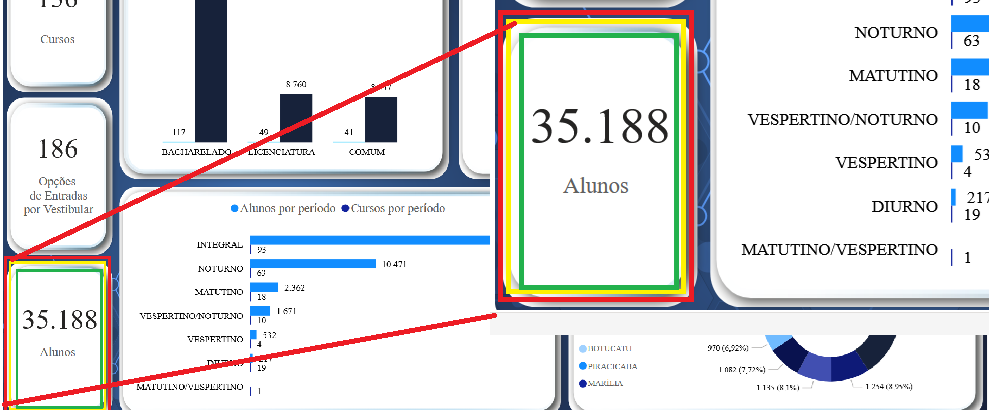
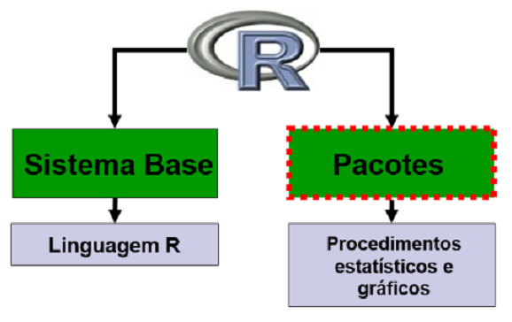

```{r setup, include=FALSE}
options(htmltools.dir.version = FALSE)
knitr::opts_chunk$set(echo = FALSE, 
                      warning = FALSE,
                      error = FALSE, 
                      message = FALSE ,
                      fig.align = "center")
```
class: middle, center, inverse

# INTRODUÇÃO

## Modelos Matemáticos 

---

### Modelos Determinísticos: 

Nesse modelo as condições sob as quais um experimento é executado determinam o resultado do experimento. 

**Exemplo**: Segunda Lei de Newton:

$$F = m \cdot a$$

Esse modelo diz que o valor da força $F$ pode ser calculado tão logo os valores da massa do objeto $m$ e sua aceleração $a$ sejam fornecidos. Nesse tipo de modelo, quaisquer desvios que pudessem ocorrer seriam tão pequenos que a descrição acima seria suficiente para modelá-lo.

**Seu resultado é determinado pelas condições sob as quais o experimento é executado**.

Exemplo de mecânica clássica, astronomia, termodinâmica, circuítos elétricos e química etc.

---

### Exemplos de fenômenos determinísticos

.pull-left[
 


]

.pull-right[


]

---

```{r,echo=FALSE,message=FALSE,error=FALSE,warning=FALSE}
library(tidyverse)

df<- tibble(
  massa = 0:100,
  aceleracao = 2,
  dados = massa*aceleracao,
  modelo_de = dados
)
df %>% 
  ggplot()+
  geom_point(aes(x=massa,y=dados,fill="Dados"),color="black",size=3)+
  geom_line(aes(x=massa,y=modelo_de,linetype="Modelo"),color="red")+
  labs(x="Massa (kg)",y="Forca (N)",title = "Modelo Deterministico",
       fill="",linetype="")+
  annotate(geom = "text",x=60,y=50,label = 'bold("aceleração = 2 m/s²")',
            parse = TRUE) 
```

$$Dados = Modelo$$

---

### Modelos Estocásticos (não-determinísticos ou probabilísticos): 

Para um grande número de situações na natureza, o modelo determinístico apresentado é suficiente, contudo existem fenômenos que requerem um modelo matemático diferente, como por exemplo a taxa de crescimento de qualquer população.


**Nesse modelo admitimos que as condições nas quais o ensaio é executado determinam somente o comportamento probabilístico do resultado observável**. 

--

**Exemplo:** em fenômenos meteorológicos, não podemos determinar qual será a precipitação em uma determinada região como resultado de uma chuva. 

.pull-left[


]

.pull-right[
Observações como temperatura, pressão, velocidade do vento e umidade relativa do ar podem fornecer um prognóstico geral da chuva (fraca, média ou forte) entretanto, não tornam possível predizer quanta chuva cairá.
]

---
```{r,echo=FALSE,message=FALSE,error=FALSE,warning=FALSE}
set.seed(1235)
df<- tibble(
  umidade = 10:100,
  a = 2,
  ruido = rnorm(101-10,0,3),
  dados = umidade*a + ruido,
  modelo_es = umidade*a
)
df %>% 
  ggplot()+
  geom_point(aes(x=umidade,y=dados,fill="Dados"),color="black",size=3)+
  geom_line(aes(x=umidade,y=modelo_es,linetype="Modelo"),color="red")+
  labs(x="Umidade relativa em T0 (%)",y="Chuva em T1 (mm)",title = "Modelo Estocastico (Probabilistico)",
       fill="",linetype="")
```
$$Dados = Modelo + Ruído$$

---

### Outros exemplos de fenômenos estocásticos (probabilísticos)

.pull-left[
- Tempo gasto em "Telas"


- Padrão de Consumo

]

.pull-right[
- Produtividade de uma cultura


- Ganho de peso de bovinos

]

---

## Padrão do emissão de Gases estufa


---


## Importância da Estatística

Assim, podemos concluir que...

> ...a Estatística é fundamental na análise de dados provenientes de quaisquer processos onde exista variabilidade, estando interessada nos métodos e processos quantitativos que servem para a 

> - *coleta*; 
> - *organização*; 
> - *resumo*; 
> - *apresentação*; 
> - *análise* 

> bem como na **obtenção de conclusões válidas** e na **tomada de decisões** a partir de tais análises.


---

#### Coleta informações

- Entrevista estruturada com produtores rurais sobre uso de fertilizantes.  
- *Medição direta em campo*, como teor de carbono no solo em diferentes áreas.  
- *Experimento controlado*, comparando produtividade sob diferentes doses de nitrogênio.  
- Uso de *sensores automáticos*, registrando temperatura e umidade a cada hora.  
- Extração de *dados secundários*, como séries históricas do Instituto Brasileiro de Geografia e Estatística (IBGE).  
- **Aplicação de questionário** a alunos para levantar horas de estudo por semana. Ferramenta aplicada na primeira semana de aula.


---

#### Organização

Etapa em que os dados coletados são **estruturados** de forma sistemática, para permitir leitura, conferência e posterior análise. Envolve classificação, codificação, ordenação e tabulação.

Exemplo: na coleta dos dados das turmas, os dados estão dispersos, na ordem em que foram registrados. Organizar significa:

- ordenar as idades em ordem crescente;  
- corrigir ou retirar inconsistências;  
- construir uma tabela de frequências;  
- agrupar em classes (por exemplo para idade: 17–18, 19–20, 21–22 anos);
- codificar variáveis categóricas, (ex.: sexo: 0 = feminino, 1 = masculino).

Após essa etapa, os dados deixam de ser uma lista desestruturada e passam a ter forma adequada para análise. Como exemplo temos [dados-turmas-2026.xlsx](https://raw.githubusercontent.com/arpanosso/estatinfo/refs/heads/master/data/dados-turmas-2026.xlsx)


---

#### Resumo

É a etapa em que os dados organizados são sintetizados por meio de medidas numéricas ou representações simples, reduzindo a informação sem perder o essencial.

**Horas de estudo por semana (variável quantitativa)**

- O resumo é feito com medidas de posição e dispersão.

```{r, echo=FALSE}
library(tidyverse)
data_set <- readxl::read_xlsx("../data/dados-turmas-2026.xlsx")

data_set |> 
  reframe(
    Media = round(mean(horas_de_estudo),2),
    Mediana = round(median(horas_de_estudo),2),
    Desvio_padrao = round(sd(horas_de_estudo),2),
    Maximo = max(horas_de_estudo),
    Minimo = min(horas_de_estudo)
  ) |> DT::datatable()

```

Isso permite descrever tendência central e dispersão em poucas medidas.


---

#### Resumo

**Curso dos alunos (variável qualitativa)**

- O resumo é feito por frequências:

```{r}
data_set |> 
  group_by(curso) |> 
  summarise(
    Freq_absoluta = n(),
    .groups = "drop"
    ) |> 
  mutate(
    Freq_relativa = round(Freq_absoluta/sum(Freq_absoluta),2),
    Freq_porcent = paste0(round(Freq_relativa*100),"%")
  )|> select(curso, Freq_porcent) |>  DT::datatable()
```


**OBS**: Aqui não faz sentido calcular média, o resumo adequado é por proporções.
---

#### Apresentação (visualização)

É a etapa em que os dados já organizados e resumidos são exibidos de forma visual ou tabular, para facilitar a comunicação e a interpretação.

**Horas de estudo por semana (variável quantitativa)**

- Tabela de frequências por classes

```{r}
data_set |> 
  mutate(
    classe_estudo = cut(horas_de_estudo,6)
  ) |> 
  group_by(classe_estudo) |> 
  summarise(
    Freq_absoluta = n(),
    .groups = "drop"
    ) |> 
  mutate(
    Freq_relativa = round(Freq_absoluta/sum(Freq_absoluta),2),
    Freq_porcent = paste0(round(Freq_relativa*100),"%")
  )|> DT::datatable()
```

---
- Histograma, gráfico de distribuição das horas.

```{r}
data_set |> 
  ggplot(aes(x=horas_de_estudo, y=..density..)) +
  geom_histogram(color="black", fill="steelblue")+
  theme_minimal()
```
---

- Boxplot, destacando mediana, quartis e possíveis outliers.

```{r}
data_set |> 
  ggplot(aes(y=horas_de_estudo)) +
  geom_boxplot(color="black", fill="orange")+
  theme_minimal() +
  xlim(-.75,.75)
```


---
**Curso dos alunos (variável qualitativa)**

- Tabela de frequências absolutas e relativas.

```{r}
data_set |> 
  group_by(curso) |> 
  summarise(
    Freq_absoluta = n(),
    .groups = "drop"
    ) |> 
  mutate(
    Freq_relativa = round(Freq_absoluta/sum(Freq_absoluta),2),
    Freq_porcent = paste0(round(Freq_relativa*100),"%")
  ) |>  DT::datatable()
```
---

- Gráfico de barras, comparando ADM e AGRO.


```{r}
data_set |> 
  ggplot2::ggplot(ggplot2::aes(x = forcats::fct_infreq(curso))) +
  ggplot2::geom_bar(fill = "steelblue", color = "black") +
  ggplot2::geom_text(stat = "count", ggplot2::aes(label =  ggplot2::after_stat(count)),
            vjust = -0.5, size = 4) +
  ggplot2::labs(
    x = "Curso",
    y = "Frequencia Absoluta"
  ) +
  ggplot2::theme_minimal() +
  ggplot2::theme(axis.text.x =  ggplot2::element_text(angle = 30, hjust = 1))
```
---

- Gráfico de setores (pizza), mostrando proporções.

```{r}
data_set |> 
  group_by(curso) |> 
  summarise(
    n = n(),
    .groups = "drop"
  ) |> 
  mutate(
    Freq_Relativa = n/sum(n),
    porc     = round(Freq_Relativa,2),
    rotulo   = paste0(curso, "\n", round(porc,2), "%")
  ) |> 
  ggplot(aes(x = "", y = porc, fill = curso)) +
  geom_col(width = 1, color = "white") +
  scale_fill_manual(values = c("orange","lightblue")) +
  coord_polar(theta = "y") +
  geom_text(aes(label = paste0(porc*100, "%")),
            position = position_stack(vjust = 0.5), size = 6.5) +
  labs(
    title = "Proporção de Alunos por Curso",
    fill  = "Curso"
  ) +
  theme_void()
```
---

#### Análise 

Etapa em que se aplicam métodos estatísticos para responder a uma pergunta de interesse, indo além da descrição.

**EXEMPLO**

> **Pergunta**: o tempo médio de estudo é diferente entre os sexos?

Temos:

- Variável quantitativa: **horas de estudo por semana**.
- Variável qualitativa: **sexo**.

---

```{r}
data_set |> 
  ggplot(aes(y=horas_de_estudo, x=sexo, fill=sexo)) +
  geom_boxplot(color="black") +
  theme_minimal() +
  theme(
    legend.position = "none"
  )
```

---

#### Hipóteses

$$
\begin{cases}
H_0: \mu_F = \mu_M \\
H_1: \mu_F \neq \mu_M
\end{cases}
$$
A análise permite concluir, com base em evidência estatística (valor-p, intervalo de confiança), se a diferença observada pode ser atribuída ao acaso ou não.

```{r}
he_m = data_set |> filter(sexo=="Masculino") |> pull(horas_de_estudo)
he_f = data_set |> filter(sexo=="Feminino") |> pull(horas_de_estudo)
t.test(he_f, he_m,alternative = "t")
```
Observa-se uma diferença média maior no grupo $F$, com evidência marginal $(p = 0,063)$, sugerindo uma possível tendência de maior tempo de estudo nesse grupo, embora sem significância estatística ao nível de $5\%$.
---

### Análise

O ciclo analítico pode ser ampliado com a inclusão de uma nova variável no **modelo**.

Nesse contexto, além de comparar cursos ou sexos isoladamente, podemos investigar uma questão mais específica:

> **Pergunta**: Existem diferenças nas horas de estudo entre os sexos dentro de cada curso?

Ou seja, a comparação passa a considerar simultaneamente curso e sexo, permitindo avaliar não apenas efeitos principais, mas também a possível interação entre esses fatores.


---
```{r}
data_set |> 
  ggplot(aes(y=horas_de_estudo, x=sexo,fill=sexo)) +
  geom_boxplot(color="black") +
  theme_classic() + 
  facet_wrap(~curso)
```


---

```{r}
data_set |> 
  ggplot(aes(y=horas_de_estudo, x=curso,fill=curso)) +
  geom_boxplot(color="black") +
  theme_classic() + 
  scale_fill_manual(values = c("orange2","lightblue"))+
  facet_wrap(~sexo)
```

A análise continua ...

---
## Estatística

Para compreender esse ciclo, a Estatística é estruturada em três grandes áreas:

I - **Estatística Descritiva**: envolve organização, resumo e apresentação dos dados.

II - **Probabilidade**: fornece a base teórica para modelar a incerteza e o comportamento aleatório.

III - **Inferência Estatística**: utiliza a probabilidade para tirar conclusões sobre a população com base em uma amostra (estimação e testes de hipóteses).

A Descritiva descreve os dados observados; a Probabilidade modela o acaso; a Inferência permite generalizar resultados.

---
class: middle, center, inverse

# I - ESTATÍSTICA DESCRITIVA

---
## Estatística Descritiva

Utilizada nas etapas iniciais dos trabalhos, se refere à maneira de representar dados em tabelas e gráficos, resumi-los por meio de algumas medidas **sem, contudo, tirar conclusões sobre um grupo maior**.

É necessário, portanto, definirmos os nossos termos básicos para podermos nos comunicar durante a disciplina. Assim, serão definidos alguns conceitos.
--

### Dados
--

Considerados o material básico da estatística, são os valores observados de uma característica de interesse de cada amostra, é o registro da característica de interesse. 

---

**Exemplos**

--

- Variação de temperatura no processo de secagem de um alimento.
- Tempo de reabilitação de doentes após determinados tratamentos.
- Número de produtos defeituosos em lotes oriundos de uma linha de montagem.
- Peso e alturas de plantas de uma determinada variedade após aplicação de um trato cultural.


--

Cada número desses constituem os **DADOS** e a característica comum entre eles é a **VARIABILIDADE** ou **VARIAÇÃO**.

---

**Exemplo de um banco de dados**


---
### População Comum

É o conjunto de pessoas ou elementos que compartilham uma característica observável e que constituem o universo de interesse de um estudo. É o conjunto total de unidades sobre as quais se deseja tomar uma decisão.

Exemplo: todos os moradores de uma cidade; todos os alunos de uma universidade.
</img>

---

**Populações Estatísticas**: É o conjunto de todas as unidades estatísticas (indivíduos, objetos ou eventos) sobre as quais se deseja estudar uma ou mais variáveis. A população estatística não é formada pelos "dados", mas pelos elementos que possuem as características de interesse, mesmo que ainda não tenham sido observados.

.pull-left[
- Valores de pressão sanguínea de indivíduos.

</img>

População: Pessoas de uma cidade.
]

.pull-right[- Presença ou ausência de doenças.

</img>

População: Cervídeos do Pantanal
]

---

### População Estatistica


.pull-left[
- Nível de satisfação de funcionário.

</img>

População: Todos os funcionários da empresa.

]

.pull-right[

- Valores de produção de soja no Brasil.

</img>

População: Todas as propriedades produtoras de soja do estado do MT.
]

---

### Amostra

Amostra é qualquer subconjunto da população.

</img>

- Não conseguimos acessar toda uma população para estudar as características de interesse, tomaremos alguns elementos dessa população para formar um grupo a ser estudado.

- Impossibilidade de acesso e implicações éticas.

---
.pull-left[
### Parâmetro: 

É a medida usada para descrever uma característica da população, por exemplo: média populacional $(\mu)$ ou a variância populacional $(\sigma^2)$.]

.pull-right[
### Estatística
É a medida usada para descrever uma característica da amostra, em analogia, média amostral $(\bar{x}\text{ ou } \hat{m} )$ e a variância amostral $(s^2)$.
]

</img>

---

### Variável

As informações obtidas, sejam com base nos elementos que constituem a população, sejam com base nos elementos que constituem a amostra, são denominadas **dados**. 

Assim, definimos que todo dado coletado refere-se a uma característica da população, agora, para nós  determinada **VARIÁVEL**.

</img>

---

### Variável Qualitativa

É aquela que apresenta como possíveis realizações uma qualidade (ou atributo) do indivíduo pesquisado.

**Nominal**: é aquela para a qual **não existe ordenação** alguma das possíveis realizações (característica observados). Em estatística dizemos que os dados são **categóricos**. 

</img>

---

**Ordinal**: é aquela para a qual **existe certa ordem** nos possíveis resultados. Apesar de ordenar, não permite a indicação em termos de quanto mais ou menos.

</img>

---
### Variável Quantitativa 

**Discreta**: os possíveis valores formam um conjunto enumerável resultam, frequentemente, de um **processo  contagem** (os valores podem ser finito ou mesmo infinitos). Exemplos: número de filhos, número de células, número de ovos, número de ácaros ou insetos em uma planta.

</img>

---

### Variável Quantitativa 

**Contínua**: os possíveis valores formam um intervalo de números reais e que resultam, normalmente, de um processo de medida (mensuração). Exemplos: peso, altura, produção de leite, pressão arterial, teor de nitrogênio no solo, desconto em folha de pagamento, valor de aluguel.

</img>

---
class: middle, center, inverse

## SOMATÓRIA
---

**Conjunto de dados**: Nessa notação, a variável numérica de interesse (altura, idade ou peso, por exemplo) será representada pelas letras maiúsculas do nosso alfaveto latino $X$, $Y$, $Z.$

O conjunto de dados terá o tamanho $n$, que representa o número de elementos que ele contém. Em outras palavras, $n$ representa o tamanho da amostra, o **número de observações** ou de **realizações** da variável.

Os valores específicos assumidos por tais variáveis serão representados pelas letras minúsculas $x$, $y$ e $z$, respectivamente, seguidas de um índice $i$ que representa a posição daquele valor específico dentro do conjunto de dados. 

Assim, para distinguir um valor do outro, utilizamos esse índice  $i$, que pode ser entendido como uma *variável auxiliar*, utilizada para contagem, que se inicia na posição $1$ e termina na última posição, $n$, abrangendo todo o seu conjunto de dados.

Assim temos:

$\text{Altura}: X = \{x_1, x_2, ..., x_n\}, \text{ com  }i = 1,2,..,n.$

$\text{Idade}: Y = \{y_1, y_2, ..., y_n\}, (i = 1,2,..,n).$

$\text{Peso}: Z = \{z_1, z_2, ..., z_n\}, (i = 1,2,..,n).$

Nessa notação um valor típico da variável *Altura*, será designado por $x_i$ e o valor final por $x_n$. 

---

**Somatória**: Ao realizar a análise de uma variável quantitativa é necessário somar todos os seus valores. 

Essa operação é frenquetemente utilizada na estatística, assim, utiliza-se uma notação compacta para representar a soma de todos os valores de uma variável de interesse. 

Portanto, dado a variável $X$ a soma de todos seus valores será notada pela letra grega *sigma* maiúscula $\Sigma$:

Dados $X = \{x_1, x_2, x_3, x_4, x_5\}$, a soma desses $5$ valores:

$x_1 + x_2 + x_3 + x_4 + x_5$

será representada pela notação:

$\sum\limits_{i=1}^{n}{x_i}$ ou $\sum_{i=1}^{n}{x_i}$

onde $i$ atua como o índice, ou seja, a cada *iteração* ele muda e representa um dos $5$ valores  de $X$.

---

### Exemplo
Dado duas variáveis  $X = \{3,0,5,9,7\}$ e $Y = \{2,3,9,1,2\}$, calcular:


Qual a somatória do produto entre as variáveis $X$ e $Y$:

Dado $X = \{3,0,5,9,7\}$ e $Y = \{2,3,9,1,2\}$, calcular:

$\sum\limits_{i=1}^{n}{x_iy_i}$

$\sum\limits_{i=1}^{n}{x_i y_i}= x_1 \cdot y_1 + x_2 \cdot y_2 + x_3 \cdot y_3 + x_4 \cdot y_4 + x_5 \cdot y_5$

$\sum\limits_{i=1}^{n}{x_i y_i}= 3 \cdot (2) + 0\cdot( 3) + 5 \cdot(9) + 9 \cdot(1) + 7 \cdot(2)$

$\sum\limits_{i=1}^{n}{x_i y_i}= 6 + 0 + 45 + 9 + 14 = 74$

---

**Propriedades da Somatória**
    
**i)** A somatória de uma constante $(k)$ é igual ao produto  $n \cdot k$.

$\begin{aligned} \sum \limits_{i=1}^{n}{k} &= k + k + \cdots + k \\ &= n \cdot k\end{aligned}$

---

**ii)** A somatória dos produtos de uma constante $k$ e uma variável $X$ é igual ao produto da constante pela soma dos valores da variável.

$\begin{aligned} \sum\limits_{i=1}^{n}{k \cdot x_i} &= k \cdot x_1 + k \cdot x_2 + \cdots + k \cdot x_n \\ &= k \cdot  (x_1 + x_2+ \cdots + x_n) \\ &= k \sum\limits_{i=1}^{n}{x_i} \end{aligned}$ 

---

**iii)** A somatória da soma de duas variáveis é igual à adição das somatórias individuais dessas duas variáveis:


$\begin{aligned} \sum\limits_{i=1}^{n}{(x_i+y_i)} &= (x_1 + y_1 + x_2 + y_2 + \cdots + x_n + y_n) \\ &= (x_1 + x_2 + \cdots + x_n) + (y_1 + y_2 + \cdots + y_n) \\ &= \sum\limits_{i=1}^{n}{x_i} + \sum\limits_{i=1}^{n}{y_i} \end{aligned}$

---

## Exercícios

1) Calcular: $\sum\limits_{i=1}^{n}{(k \cdot x_i+k)}=?$


2) Dado a média sendo: 

$\bar{x} = \frac{\sum\limits_{i=1}^{n}{x_i}}{n}$

Provar que:

$\sum\limits_{i=1}^{n}{(x_i-\bar{x})}=0$

---

### Resposta

1) 
$\sum\limits_{i=1}^{n}{(k \cdot x_i+k)}=?$

$\sum\limits_{i=1}^{n}{(k \cdot x_i+k)} = \sum\limits_{i=1}^{n}{ k \cdot x_i} + \sum\limits_{i=1}^{n}k$

$\sum\limits_{i=1}^{n}{(k \cdot x_i+k)} = \sum\limits_{i=1}^{n}{k \cdot x_i} + \sum\limits_{i=1}^{n}k$

$\sum\limits_{i=1}^{n}{(k \cdot x_i+k)} = k \cdot \sum\limits_{i=1}^{n}{x_i} + n \cdot k$

---

### Resposta

2) Dado: $\bar{x} = \frac{\sum\limits_{i=1}^{n}{x_i}}{n}$, 

$\sum\limits_{i=1}^{n}{(x_i-\bar{x})}= \sum\limits_{i=1}^{n}{x_i}-\sum\limits_{i=1}^{n}{\bar{x}}$

$\sum\limits_{i=1}^{n}{(x_i-\bar{x})}= \sum\limits_{i=1}^{n}{x_i}-n \cdot {\bar{x}}$

$\sum\limits_{i=1}^{n}{(x_i-\bar{x})}= \sum\limits_{i=1}^{n}{x_i}-n \cdot \frac{\sum\limits_{i=1}^{n}{x_i}}{n}$

$\sum\limits_{i=1}^{n}{(x_i-\bar{x})}= \sum\limits_{i=1}^{n}{x_i}-\sum\limits_{i=1}^{n}{x_i} =0$


---
class: middle, center, inverse

# Distribuição de Frequência

```{r, echo=FALSE, eval=FALSE}
library(tidyverse)
library(patchwork)
idade <- rnorm(500,22,3.5)
altura <- rnorm(100,1.72,0.05)
peso <- rbinom(1000,50,.2) + 55
pas <- rnorm(100, 119, 8.2)

plt1 <- as_tibble(idade) |> 
  ggplot(aes(x=idade,y=..density..)) + 
  geom_histogram(bins = 10, color="black",
                 fill="gray") +
  theme_bw() +
  labs(x="Idade (anos)", y="Densidade")

plt2 <- as_tibble(altura) |> 
  ggplot(aes(x=altura,y=..density..)) + 
  geom_histogram(bins = 10, color="black",
                 fill="aquamarine4") +
  theme_bw() +
  labs(x="altura (m)", y="Densidade")

plt3 <- as_tibble(peso) |> 
  ggplot(aes(x=peso,y=..density..)) + 
  geom_histogram(bins = 10, color="black",
                 fill="orange3") +
  theme_bw() +
  labs(x="Peso (g)", y="Densidade")


plt4 <- as_tibble(pas) |> 
  ggplot(aes(x=pas,y=..density..)) + 
  geom_histogram(bins = 10, color="black",
                 fill="red") +
  theme_bw() +
  labs(x="Pressão arterial sistólica (mm Hg)", y="Densidade")
(plt1|plt2)/(plt3|plt4)
library(tidyverse)
data_set <- readxl::read_xlsx("../data/dados-turmas-2026.xlsx")

```

---
### Distribuição de frequência de uma variável

Quando analisamos uma variável aleatória (qualitativa ou quantitativa), deve-se conhecer a distribuição de frequência dessa variável por meio de suas possíveis realizações (observações). 

Assim, o objetivo dessa aula será apresentar as principais formas e visualização gráfica de variáveis quali e quantitativas. 

**Exemplo:** Considerando os [dados-turmas-2026.xlsx](https://raw.githubusercontent.com/arpanosso/estatinfo/refs/heads/master/data/dados-turmas-2026.xlsx) amostrados das turmas de Estatísticas temos:

Podemos organiza-los da seguinte forma: [dados-turmas-2026.pdf](https://raw.githubusercontent.com/arpanosso/estatinfo/refs/heads/master/docs/dados-turmas-2026.pdf)


---
**Tamanho da População $(N)$**

O tamanho da população $N$ é o número total dos elementos alvos da pesquisa. Muitas vezes não conhecemos esse valor. 


$$
N = \text{tamanho da população (desconhecido)}
$$
Em nosso exemplo, poderíamos entender como $N$ o número de todos os alunos de graduação da Unesp.

$$
N = 35188
$$

Maiores informações, acesso o Painel [Somos UNESP](https://app.powerbi.com/view?r=eyJrIjoiMzM4YjhhOGMtMDQyNS00Y2VhLTk2ZDAtZThkMTU3ZWVhNTE0IiwidCI6ImZlODc4N2JjLWM5MTQtNDY2NS04NTQ3LTI2OGUxNWNiMGQ5YSJ9)




---

**Tamanho da amostra $(n)$**

É o número total de registros de sua base de dados, ou seja o número total de elementos amostrados da população. 

Em nosso exemplo é o número de alunos que responderam ao formulário.

$$
n =91
$$


```{r, echo=FALSE, out.width="10%", fig.align='left'}
# knitr::include_graphics("imgs/R_logo.png")
```


```{r, echo=FALSE}
library(tidyverse)
library(readxl)
dados_turmas_2026 <- read_xlsx("../data/dados-turmas-2026.xlsx")
```


---
### Variável sexo (qualitativa nominal)

Agora Construir uma tabela de frequências para a variável `sexo` contendo as frequências absolutas $(n_i)$, as frequências relativas $(f_i)$ e a porcentagem de frequência $(perc)$ para as categorias $Feminino$ e $Masculino$. 

Agora podemos definir o número de categorias dessa variável como $k$, ou seja, nesse caso:

$$ k = 2$$

---
### Frequência Absoluta $(n_i)$

É definida como o número de observações no conjunto de dados pertencentes à uma categoria/classe da variável em estudo.

Então, consideramos $n_1$ para sexo $Feminino$ e $n_2$ para sexo $Masculino$, temos:

$n_1 = 33$

$n_2 = 58$

```{r, echo=FALSE, out.width="10%", fig.align='left'}
# 
```


```{r, echo=FALSE}
# dados_turmas_2026 |> 
#   count(sexo)
```


---
Observe que a somatória da frequência absoluta das classes $(k)$ da variável cetegória é igual a $n$. 

$$
\sum \limits_{i=1}^{k}{n_i} = n
$$

sendo $k$ é o número de categorias.

$$
\begin{aligned}
\sum_{i=1}^{k} n_i &= n_1 + n_2 \\
                   &= 33 + 58 \\
                   &= 91
\end{aligned}
$$

---

**Frequência Relativa $(f_i)$**

É definida como a proporção de cada categoria em relação ao **Total de observações** $(n)$, ou seja:

$$
f_i = \frac{n_i}{n}
$$

Portanto temos que:


- Para categoria $Feminino$:

$$
f_1 = \frac{33}{91}=0{,}3626
$$ 

- Para categoria $Masculino$  

$$
f_2 = \frac{58}{91}=0{,}6373
$$
---

Observe que a somatória das frequências relativas sempre será igual a $1$: 

$$
\begin{aligned}
\sum_{i=1}^{k} f_i &= f_1 + f_2 \\
                   &= 0{,}3626 + 0{,}6373 \\
                   &= 1
\end{aligned}
$$

sendo $k$, o número de categorias da variável `sexo`.

---

**Porcentagem de frequência $(perc \text{, %})$**

Definida como o resultado da multiplicação da frequência relativa (proporção) por $100$.


$$perc_1 = f_1 \times 100 = 0{,}3626 \times 100 = 36{,}26\% \\
perc_2 = f_2 \times 100 = 0{,}6373 \times 100 = 63{,}73\%$$


De maneira análoga, a somatória das porcentagens sempre será igual a $100$: 

$$
\begin{aligned}
\sum_{i=1}^{k} perc_i &= perc_1 + perc_2 \\
                   &= 36{,}26 + 63{,}73 \\
                   &= 100
\end{aligned}
$$


---
Assim, temos a tabela de frequência da variávies **sexo (Qualitativa)**

```{r,echo=FALSE}
dados_turmas_2026 |>
  group_by(sexo) |> 
  summarise(ni=n()) |> 
  mutate(fi = ni/sum(ni),
         perc = fi*100) |> 
  kableExtra::kable()
```


A partir das tabelas de frequência, poderemos criar representações gráficas que nos auxiliarão na apresentação e interpretação do comportamento dos dados.

Essa etapa é a denominada de **Apresentação - Visualização de Dados**. 


```{r, echo=FALSE, out.width="10%", fig.align='left'}
# 
```


```{r, echo=FALSE}
# 
# Precisaremos, então, fazer algumas operações nos dados das turmas e vamos usar o operador `PIPE` (`|>`), cujo atalho é `CTRL + SHIFT + M`. 
# 
# - `n()` para contar cada ocorrência das diferentes categorias da variável  `sexo`.
# - `group_by()` agrupa a variável `sexo` por suas diferentes categorias.
# - `summarise()` cria o resumo dos dados, ou seja, contará o valor de cada categoria usando a função `n()` e salvará na coluna `ni`.
# - `mutate()` é a função utilizada para calcular $f_i$ e suas respectivas procentagens $prec_i$ a partir da coluna $_i$.
# 
# dados_turmas_2026  |> 
#   group_by(sexo) |>  
#   summarise(ni=n()
#             )  |>  
#   mutate(fi = ni/sum(ni),
#          perc = fi*100) 
```


---
class: middle, center, inverse

# APRESENTAÇÃO - VISUALIZAÇÃO DE DADOS
## (Variáveis Qualitativas)

---

## Apresentação - Visualização dos dados

Os tipos de gráficos variam de acordo com o tipo de variável, geralmente, para as **variáveis qualitativas** utilizamos os gráficos de:

- Barras;
- Colunas; 
- Setores (Pizza). 

---

### Gráfico de Colunas para variável sexo

```{r, plot1, echo=FALSE}
dados_turmas_2026 |>
  group_by(sexo) |> 
  summarise(ni=n()) |> 
  mutate(fi = ni/sum(ni),
         perc = fi*100) |> 
  ggplot(aes(x=sexo, y=fi)) + 
  geom_col(
    fill="lightblue",
    color="black"
  )+
  theme_minimal()
```


---

### Gráfico de Barras para variável sexo

Semelhante ao gráfico de colunas, contudo, com as barras na horizontal, facilita a leitura do nome das categorias.

```{r, plot2, echo=FALSE}
dados_turmas_2026 |>
  group_by(sexo) |> 
  summarise(ni=n()) |> 
  mutate(fi = ni/sum(ni),
         perc = fi*100) |> 
  ggplot(aes(x=fi,y=sexo)) + 
  geom_col(fill="orange4",
           color="black") +
  theme_classic()
```

---


### Gráfico de Setores para variável sexo

```{r, plot3, echo=FALSE}
dados_turmas_2026 |> 
  group_by(sexo) |> 
  summarise(
    n = n(),
    .groups = "drop"
  ) |> 
  mutate(
    Freq_Relativa = n/sum(n),
    porc     = round(Freq_Relativa,2),
    rotulo   = paste0(sexo, "\n", round(porc,2), "%")
  ) |> 
  ggplot(aes(x = "", y = porc, fill = sexo)) +
  geom_col(width = 1, color = "white") +
  scale_fill_manual(values = c("orange","lightblue")) +
  coord_polar(theta = "y") +
  geom_text(aes(label = paste0(porc*100, "%")),
            position = position_stack(vjust = 0.5), size = 6.5) +
  labs(
    title = "Proporção de Alunos por Sexo",
    fill  = "Sexo"
  ) +
  theme_void()
```

---

## Tabela de Frequência para a variável Cor de cabelo

Construir a tabela de frequência para variável `cor_cabelo`. 

--

```{r, eval=TRUE, echo=FALSE}
tab <- dados_turmas_2026 |>
  group_by(cor_cabelo) |> #<< 
  summarise(ni=n()) |>      
  mutate(fi = ni/sum(ni),    
         perc = fi*100)      
kableExtra::kable(tab)
```

---

### Gráfico de Colunas para Cor de cabelo

```{r, plot4, echo=FALSE}
dados_turmas_2026 |>
  group_by(cor_cabelo) |> #<< 
  summarise(ni=n()) |>      
  mutate(fi = ni/sum(ni),    
         perc = fi*100) |> 
  ggplot(aes(x=cor_cabelo,y=fi,
             fill=cor_cabelo)) + #<<
  geom_col(color="black")+
  scale_fill_manual(
    values = c(
      "Loiro" = "orange",
      "Castanho Claro" = "brown1",
      "Castanho Escuro" = "brown4",
      "Preto" = "black"
    )
  )+
  theme_bw() #<<
```


---

### Gráfico de Barras para Cor de cabelo

```{r, plot5, echo=FALSE}
dados_turmas_2026 |>
  group_by(cor_cabelo) |> #<< 
  summarise(ni=n()) |>      
  mutate(fi = ni/sum(ni),    
         perc = fi*100) |> 
  ggplot(aes(x=fi, y=cor_cabelo,
             fill=cor_cabelo)) + 
  geom_col(color="black")+
  scale_fill_manual(
    values = c(
      "Loiro" = "orange",
      "Castanho Claro" = "brown1",
      "Castanho Escuro" = "brown4",
      "Preto" = "black"
    )) +
      theme_minimal()
```


---
### Gráfico de Setores para cor_cabelo

```{r, plot6, echo=FALSE}
dados_turmas_2026 |> 
  group_by(cor_cabelo) |> 
  summarise(
    n = n(),
    .groups = "drop"
  ) |> 
  mutate(
    Freq_Relativa = n/sum(n),
    porc     = round(Freq_Relativa,2),
    rotulo   = paste0(cor_cabelo, "\n", round(porc,2), "%")
  ) |> 
  ggplot(aes(x = "", y = porc, fill = cor_cabelo)) +
  geom_col(width = 1, color = "white") +
  coord_polar(theta = "y") +
  geom_text(aes(label = paste0(porc*100, "%")),
            position = position_stack(vjust = 0.5), size = 6.5) +
  scale_fill_manual(
    values = c(
      "Loiro" = "orange",
      "Castanho Claro" = "brown1",
      "Castanho Escuro" = "brown4",
      "Preto" = "darkgray"
    )) +
  labs(
    title = "Proporção de Alunos por Cor do Cabelo",
    fill  = "cor_cabelo"
  ) +
  theme_void()
```

---

## Tabela de Frequência e Visualização dos dados

**Variável Altura (Quantitativa Contínua)**

Quando a variável quantitativa, construímos a tabela de frequência, podemos utilizar intervalos de classes e os principais gráficos são:

- histograma; 
- boxplot; 
- Distribuição acumulada 

Devemos, inicialmente construir a tabela de frequência da variável `altura`. Porém, os valores de uma variável contínua não se repetem, mesmo que isso aparentemente ocorra na base de dados. 

Em teoria suas observações podem assumir qualquer valor dentro da reta dos números $\mathbb{R}$, portanto, ao mensurar uma variável contínua, obtém-se apenas uma aproximação de seu verdadeiro valor dada pelo instrumento de medida.

---

### Tabela de frequência

Para exemplificar, vamos criar uma tabela de frequência com $k = 5$ classes de alturas.


```{r,echo=FALSE}
tab <- dados_turmas_2026 |>
  mutate(
    classes_altura = cut(altura,5) 
    ) |> 
  group_by(classes_altura) |> 
  summarise(ni=n()) |>      
  mutate(fi = ni/sum(ni),    
         perc = fi*100)  
kableExtra::kable(tab)
```

Agora vamos construir o histograma

---

### Amplitude Total $\Delta$

Vamos iniciar com a Amplitude total $(\Delta)$, definida como a diferença entre o valor máximo menos o valor mínimo da variável.

$$\Delta = Máximo - Mínimo$$

Para os dados de altura temos, $\Delta = 197-155 = 42 \;\text{cm}$


---

### Número de intervalos de classes $(k)$ 

Definiremos $k$ como sendo o número de **sub-intervalos** da Amplitude Total. Uma boa representação apresenta um $k$. 

**NUNCA** inferior a $5$ ou superior a $15$, pois com um pequeno número de classes, perde-se informação, e com um grande número de classes, o objetivo de resumir os dados fica prejudicado.

--

### Amplitude de classe $(\Delta_i)$

É o tamanho de cada um dos $k=5$ sub-intervalos, dado pela amplitude total dividida pelo número de intervalos.

$$\Delta_i = \frac{\Delta}{k}$$
Para os dados de altura:

$$\Delta_i = \frac{\Delta}{k} = \frac{42}{5} = 8{,}4 \;cm$$

---
Assim, temos que cada um dos $5$ intervalos terá uma amplitude de $8{,}4$ cm. Ou seja, o cálculo dos  limites das classes é feito a partir da adição ao valor Mínimo o valor de $\Delta_i$ um número de $k$ vezes. LI = Limite Inferior da Classe e LS = limite Superior da Classe

- Classe 1:

LI = $Mínimo = 155$  e LS = $Mínimo \times \Delta_i = 155 \times (8{,}4) = 163{,}4$

- Classe 2:

LI = LS anterior = $163{,}4$ e LS = $Mínimo \times 2\Delta_i = 155 \times 2\dot(8{,}4) = 171{,}8$

- Classe 3:

LI = $171{,}8$  LS = $Mínimo \times 3\Delta_i = 155 \times 3\dot(8{,}4) = 180{,}2$

- Classe 4:

LI = $180{,}2$  e LS = $Mínimo \times 4\Delta_i = 155 \times 4\dot(8{,}4) = 188{,}6$

- Classe 5:

LI = $188{,}6$ e LS = $Mínimo \times 2\Delta_i = 155 \times 2\dot(8{,}4) = 197$


---
### Gráfico histograma (frequências absolutas)

A partir da tabela anterior, pode-se construir o gráfico de frequência de cada classe de valor de altura, denominado **Histograma**. 

```{r,plot10,eval=TRUE,echo=FALSE}
k=5
Di = 8.4
altura <- dados_turmas_2026 |> pull(altura)
limites <- min(altura)+ 0:k * Di
# limites
dados_turmas_2026 |> 
  ggplot(aes(x=altura,y=..count..))+ #<<
  geom_histogram(breaks = limites,
                 color="black",
                 fill="gray")+
  theme_bw()
```

---

## Gráfico histograma (frequências relativas)

Ao longo de nosso curso, vamos estudar que a frequência relativa $f_i$ é uma estimativa empírica da probabilidade $P(X=x_i)$, assim é interessante que a área total da figura do histograma seja igual a $1$, correspondendo à soma total das frequências relativas $( f_i )$. 

Então, para construção do histograma, sugere-se usar no eixo das ordenadas os valores de $fi / \Delta_i$ (denominado densidade de frequência), ou seja, da medida que indica qual a concentração por unidade da variável.

```{r,plot11,eval=FALSE,echo=FALSE}
dados_turmas_2026 |> 
  ggplot(aes(x=altura,y=..density..))+ #<<
  geom_histogram(breaks = limites,
                 color="black",
                 fill="gray")
# Para isso utilizamos `y=..density..`.
```


---


```{r,plot11,echo=FALSE}
```

---

## Densidade de frequência $(d_i)$

Agora vamos atualizar a tabela com o valor de densidade de frequência, dado por:

$$d_i=\frac{f_i}{\Delta_i}$$

```{r,echo=FALSE}
tab <- dados_turmas_2026 |>
  mutate(
    classes_altura = cut(altura,5) 
    ) |> 
  group_by(classes_altura) |> 
  summarise(ni=n()) |>      
  mutate(fi = ni/sum(ni),    
         perc = fi*100,
         di=fi/Di)  
kableExtra::kable(tab)
```

---

## Medidas  Acumuladas

As medidas acumuladas são interessantes para compor algumas vizualizações:

$N_i$: Frequência Absoluta Acumulada.

$F_i$: Frequência Relativa Acumulada.

$Perc$: Porcentagem de Frequência Acumulada.

#### Tabela de Frequência para Altura

```{r,echo=FALSE}
tab <- dados_turmas_2026 |>
  mutate(
    classes_altura = cut(altura,5) 
    ) |> 
  group_by(classes_altura) |> 
  summarise(ni=n()) |>      
  mutate(fi = ni/sum(ni),    
         perc = fi*100,
         di=fi/Di,
         Ni = cumsum(ni),
         Fi = cumsum(fi),
         Perc = cumsum(perc)
  )
kableExtra::kable(tab)
```


---

## Função de Distribuição Acumulada


A função de distribuição acumulada descreve como probabilidades são associadas aos valores ou aos intervalos de valores de uma variável aleatória. Em outras palavras, ela representa a probabilidade de uma variável aleatória ser menor ou igual a um valor real qualquer $x$. 

$$
F(x) = P(X \leq x) \in [0,1].
$$

Para uma variável aleatória contínua (`altura`):

$$\int \limits_{- \infty }^x f(x_i) dx$$

```{r,plot13,eval=FALSE,echo=FALSE}
dados_turmas_2026 |> 
  ggplot(aes(x=altura))+ 
  stat_ecdf(geom = "line",color="red")#<<
```

---

```{r,plot13,echo=FALSE}
```

---


## Histograma e Polígono de Frequência

Obtemos o polígono de frequências unindo por uma poligonal (segmentos de retas) os pontos correspondentes às frequências, das classes, centradas nos pontos médios de cada classe.

Para se obter as interseções do polígono com o eixo horizontal, cria-se em cada extremo do histograma uma classe com frequência nula.

```{r,plot12,eval=FALSE, echo=FALSE}
dados_turmas_2026 |>
  ggplot(aes(x=altura, y=..count..))+ #<<
  geom_histogram(breaks = limites,
                 color="black",
                 fill="gray") +
  geom_freqpoly(breaks=limites,color="red") #<<
```


---

## Histograma e Estimativas de densidade suavizadas


Calcula e desenha a estimativa da densidade, que é uma versão suavizada do histograma. Esta é uma alternativa útil para dados contínuos que vêm de uma distribuição suave subjacente.

```{r,plot12_1,eval=FALSE}
dados_turmas_2026 |>
  ggplot(aes(x=altura,y=..density..))+ #<<
  geom_histogram(breaks = limites,
                 color="black",
                 fill="white") +
  geom_density(color="red",
               fill="green",
               alpha=0.05) #<<
```

- Observe que o histograma foi construído com as frequências absolutas $(n_i)$, ou seja, `y=..density..`. Utilizamos a função `geom_density()`.
- O argumento `alpha=0.05` controla a transparência do preenchimento.

---

```{r,plot12_1,echo=FALSE}
```


---
class: middle, center, inverse

## Prática para Casa: Instalação de Pacotes no R


[Link do Video](https://drive.google.com/drive/u/0/folders/1O-sGhicXs6unUY_y1JW8yKSHm76VVMCX)

---
**Pacote em R**

Um pacote é uma coleção de funções, exemplos e documentação. A funcionalidade de um pacote é frequentemente focada em uma metodologia estatística especial" (**Everitt & Hothorn**).




Pacotes no R são coleções de funções, exemplos e documentações, que devem ser previamente instalados e alocados no ambiente pela função `library`.

---
## Pacotes básicos

Liste os pacotes carregados no ambiente com:

```{r}
(.packages())
```

O retorno da função é uma lista de nomes, `caracteres` (ou `strings`), na forma de um *objeto* denominado **vetor**. Observe que cada pacote (elemento) é referenciado dentro do vetor por um índice, um número inteiro $[\;i\;]$ apresentado entre colchetes **[i]**.

Carregue um pacote chamando a função `library`.

```{r,message=FALSE}
library(MASS)
```


---

Agora, liste novamente os pacotes e observe a diferença no retorno da função.

```{r}
(.packages())
```

Observe que o pacote `MASS` agora está no ambiente de trabalho.


---

### Instalando pacotes

Para a realização de procedimentos estatístico e manipulação de arquivos durante o curso, serão necessários vários pacotes que não fazem parte do `base` do R, que deverão ser instalados.

**Utilizando a opção** `Packages\Install\nome do pacote`

```{r echo=FALSE, fig.cap="",fig.align='center',out.width = "450px"}
knitr::include_graphics("img/install_pac.png")
```


Instale os pacotes:

 * `tidyverse`
 * `agricolae`

---
Os pacotes também podem ser instalados a partir das linhas de comandos:

```{r,eval=FALSE}
install.packages("tidyverse")
install.packages("agricolae")
```


Agora podemos carregar esses pacotes em nosso ambiente de trabalho.

```{r,message=FALSE,error=FALSE}
library(tidyverse)
library(agricolae)
```

Vamos agora criar uma "Pipe Line" para visualização de um banco de dados

```{r,message=FALSE,error=FALSE}
mtcars |>
  glimpse()
```

O simbolo para operação de arquivos de dados é o pipe `|>` que pode ser criado a partir do atalho `CTRL + SHIFT + M`

---

## Carregando os dados no R
Para carregar o banco de dados da turma no R, siga os passos:
1.Faça o Download dos [dados_turmas.xlsx](https://arpanosso.github.io/estatinfo/data/dados_turmas.xlsx).

2.Salve em uma pasta `data` dentro de um projeto do R previamente criado.

</img>

---

3.Na aba **Environment** do RStudio selecione **Import Dataset/From Excel...** como apresentado abaixo.

</img> ]

---

4.Selecione **Browse** (destacado em vermelho no canto direito superior).

</img>

---

5.Na próxima janela busque o arquivo da base de dados **dados_turmas.xlsx** que salvamos na pasta "*data"*,  selecione o arquivo e clique em **Open**.

</img>

---
6.Na janela serão apresentados os dados, **NÃO CLIQUE EM IMPORT**, ao invés disso, **selecione e copie o código** para a importação dos dados. Após isso **CLIQUE EM CANCEL**.

</img>

---

7.Cole o código no seu script do R e o execute. Os dados serão salvos no objeto `dados_turmas`. Se necessário, instale o pacote `readxl` com as opções da aba **Packages/Install** ou com o comando `install.packages("readxl")`.


</img>

class: middle, center, inverse

# Medidas de Posição
### Medidas de Tendência Central

---

## Medidas de posição

São respostas breves e rápidas que sintetizam a informação não de uma forma de completa descrição dos dados ou eventual modelagem. 

Essas medidas, portanto, fornecem a posição da medida na reta real $(\Re)$ , ou seja, informa sobre a posição de um conjunto de dados. As principais medidas são: 

1. Média:  
 - **Aritmética**
 - **Ponderada**
 - Geométrica (Apostila)
 - Harmônica (Apostila)

2. Mediana 

3. Moda

---

**Média Populacional**

Para a população, a média é definida como:

 $$
 \mu = \frac{\sum \limits_{i=1}^N x_i} {N}, \text{com } i=1,2,...,N.
 $$
 
Onde $N$ é o tamanho da população (e geralmente não a conhecemos). 


**Média amostral**

É a mais utilizada das medidas de posição. A média aritmética de um conjunto de $n$ observações da variável aleatória $X$, é o quociente da divisão por $n$ da somatória dos valores das observações dessa variável. 

A média amostral $\bar{x}$ é a estimativa mais **eficiente**, **imparcial** e **consistente** da média da população $\mu$. 
 
 $$
   \bar{x} = \frac{\sum \limits_{i=1}^nx_i} {n}, \text{com} \; i=1,2,...,n.
 $$
Onde $n$ é o tamanho da amostra.

---

O exemplo a seguir apresentará o cálculo da média amostral da idade em anos de $91$ alunos (`idade`). Observe que a média tem a mesma unidade de medida que a das observações individuais. 

**Exemplo**: Para os dados de `idade`, da base de [dados-turmas-2026.pdf](https://raw.githubusercontent.com/arpanosso/estatinfo/refs/heads/master/docs/dados-turmas-2026.pdf)

#### Cálculo da Média Aritmética de Idade

Tabela de frequência para idade

.pull-left[
```{r,echo=FALSE}
library(tidyverse)
dados_turmas_2026 <- readxl::read_xlsx("../data/dados-turmas-2026.xlsx")
tab<-dados_turmas_2026  |> 
        group_by(idade) |>  
        summarise(ni=n()) |>       
        mutate(fi = ni/sum(ni),    
        #      perc = fi*100)
        ) 
kableExtra::kable(tab)
```
]

.pull-right[

$$
\begin{align}
\bar{x} & = \frac{\sum_{i=1}^nx_i}{n} \\
& = \frac{18+18+ \cdots+38}{91} \\ 
& = 19,9011\text{ anos} 
\end{align}
$$

```{r, eval=FALSE, echo=FALSE}
dados_turmas_2026 %>% 
  summarise(
    media = mean(idade)
  )
```
]
---


$$
\begin{align}
\bar{x} & = \sum_{i=1}^kf_i \cdot x_i \\
\bar{x} & = 18\cdot(0{,}2087)+19\cdot(0{,}4395) + \cdots + 49(0{,}01098) \\
\bar{x} & = 19,9011\;anos
\end{align}
$$


---
**Histograma e média para idade**


```{r,,echo=FALSE, out.width="50%"}
dados_turmas_2026 %>% 
  ggplot(aes(x=idade, y=..density..)) +
  geom_histogram(bins=7, 
                 color="black", 
                 fill="gray")+
  geom_vline(xintercept = 21, #<<
             color="blue") #<<
```

Se os dados são plotados como um histograma a média é o centro de gravidade do gráfico (linha azul). 

Ou seja, se o histograma fosse feito de um material sólido, ele se equilibraria horizontalmente com o ponto de apoio em $\bar{x}$. 
---

**Histograma e média para altura**


```{r,eval=FALSE,echo=FALSE}
dados_turmas_2026 %>% 
  pull(altura) %>% 
  mean()
```


```{r, echo=FALSE,out.width="40%"}
k <- 5
Di <- diff(range(dados_turmas_2026 %>% pull(altura)))/k
limites <- min(dados_turmas_2026 %>% pull(altura))+ 0:k * Di
dados_turmas_2026 %>% 
  ggplot(aes(x=altura, y=..density..)) +
  geom_histogram(bins=5, 
                 breaks = limites,
                 color="black", 
                 fill="gray")+
  geom_vline(
    xintercept = mean(dados_turmas_2026$altura), 
    color="blue") 
```

$$
\bar{x} = \frac{155 + 155 + \cdots+197}{91} =  172,5\text{ cm}
$$


Observe o histograma e a média para a variável `altura`, e compare sua simetria com o histograma da variável `idade`.
---

## Média Ponderada

Em algumas situações as observações têm graus de importância diferentes. Usa-se, então, a média ponderada:

$$\bar{x}_P = \frac{\sum\limits_{i=1}^{n}x_i \cdot \lambda_i}{\sum\limits_{i=1}^{n}\lambda_i}$$

Onde $\lambda_i$ é o peso associado à i-ésima observação. Assim, ele mede a importância relativa dessa i-ésima observação em relação às demais.
---

**Exemplo**: Calcular a intensidade média de infestação do complexo "Broca-podridão" da cana-de-açúcar, larva de lepidóptera (*Diatraea saccharalis*) em plantas jovens associado à infecção por fungos, causando a podridão vermelha (*Colletotrichum falcatum*), em $3$ variedades plantadas em uma área de produção.

</img>

---
</img>


$\bar{x}_P = \frac{\sum\limits_{i=1}^{n}x_i \cdot \lambda_i}{\sum\limits_{i=1}^{n}\lambda_i} = \frac{12\cdot(9,10)+40\cdot(14,57)+4\cdot(3,20)}{12+40+4}=12,58\%$


```{r, eval=FALSE, echo=FALSE}
pesos<-c(12,40,4)
X <- c(9.1,14.57,3.2)
weighted.mean(X, pesos)
```


---
## Mediana

É o valor que ocupa a posição central do conjunto de dados ordenados $(X' \text{ ou } X_o)$ que pode ser denotada por $Md$. 

Assim, antes de encontrar ou calcular a mediana as observações são ordenadas do menor para o maior valor.

o valor da mediana é precedido e seguido pelo mesmo  número de observações. E a mediana amostral é a melhor estimativa da mediana populacional quando o número de observações é grande.

A mediana será encontrada ou calculada em função do número de observações $n$ presentes na base de dados, se acaso $n$ for *ímpar* ou *par*:

Se $n$ é ímpar: $Md = Xo_{\left(\frac{n+1}{2}\right)}$

Se $n$ é par: $Md = \frac{ Xo_{\left(\frac{n}{2} \right) } + Xo_{\left(\frac{n}{2} +1\right) } }{2}$
---

**Exemplo 1**:  

Dado $X=\{50, 60, 20, 50, 30, 90, 70\}$, teremos a sua versão ordenada $X_0$ dada por:

$X_o=\{20, 30, 50, 50, 60, 70 ,90 \}$, então,

$n=7$, ímpar.

$Md = Xo_{\left(\frac{n+1}{2}\right)} = Xo_{\left(\frac{7+1}{2}\right)} =Xo_{4} = 50$


---

### Media e Mediana

Em uma distribuição simétrica (como a da variável `altura`), a mediana amostral também é uma estimativa imparcial e consistente de média populacional $\mu$, contudo não é tão eficiente como a média amostral $\bar{x}$.


```{r, echo=FALSE,eval=FALSE}
dados_turmas_2026 %>% 
  pull(altura) %>% 
  median()
```


```{r, echo=FALSE,out.width="40%"}
dados_turmas_2026 %>% 
  ggplot(aes(x=altura, y=..density..)) +
  geom_histogram(bins=6, 
                 color="black",fill="gray")+
  geom_vline(
    xintercept = c(172.5,173), #<<
    color=c("blue","red")) #<<
```


---

**Exemplo 2**: Calcular a média e a mediana dos dados de salário (nº salário mínimos), que diz respeito à uma amostra de $6$ colaboradores de uma empresa.

$$S=\{ 5, 2, 3, 6, 10, 9\}$$
$n=6$, par.

$$Md = \frac{ Xo_{\left(\frac{n}{2} \right) } + Xo_{\left(\frac{n}{2} +1\right) } }{2}$$

Assim, para os dados de salários temos:

Vetor ordenado: $So=\{ 2, 3, 5, 6, 9, 10\}$, então a mediana será dada por:

$Md = \frac{ Xo_{\left(\frac{n}{2} \right) } + Xo_{\left(\frac{n}{2} +1\right) } }{2} = \frac{ Xo_{\left(3 \right) } + Xo_{\left(4\right) } }{2}= \frac{ 5 + 6}{2} = 5,5 \text{ salários mínimos}$.

A média será dada por:

$\bar{x}= \frac{2+3+5+6+9+10}{6} = 5,83 \text{ salários mínimos}$


---

Imagine que, ao invés de $10$, o novo valor de ganho do 5º colaborador da amostra seja $100$, calcule a média e a mediana novamente para essa variável: 

$$
S=\{ 5, 2, 3, 6, 100, 9\}
$$
$n=6$, par.

$$Md = \frac{ Xo_{\left(\frac{n}{2} \right) } + Xo_{\left(\frac{n}{2} +1\right) } }{2}$$

Assim, para os dados de salários temos:

Vetor ordenado: $So=\{ 2, 3, 5, 6, 9, 100\}$, então a mediana será dada por:

$Md = \frac{ Xo_{\left(\frac{n}{2} \right) } + Xo_{\left(\frac{n}{2} +1\right) } }{2} = \frac{ Xo_{\left(3 \right) } + Xo_{\left(4\right) } }{2}= \frac{ 5 + 6}{2} = 5,5 \text{ salários mínimos}$.

A média será dada por:

$\bar{x}= \frac{2+3+5+6+9+100}{6} = 20,83 \text{ salários mínimos}$

Concluímos, então, que a mediana não é afetada por observações muito grandes ou muito pequenas, enquanto que a presença de tais extremos tem um significante efeito sobre a média.

---

## Moda


A moda é comumente definida como a medição que ocorre com mais frequência em um conjunto de dados.

Para os dados de `idade` o valor mais presente do conjunto de dados é $19$ anos.

Portanto, podemos ter distribuições com mais de um valor mais frequente (plurimodal), ou mesmo sem moda (amodal).


---

Outra forma de definir a moda como uma medida de concentração relativamente grande, pois algumas distribuições de frequência podem ter mais de um ponto de concentração, embora essas concentrações possam não conter, precisamente, as mesmas frequências.

```{r, out.width="50%", echo=FALSE}
x<-c(6, 7, 7, 8, 8, 8, 8, 8, 8, 9, 9, 10, 11, 
     12, 12, 12, 12, 12, 13, 13, 14)
tibble(x) %>% 
  ggplot(aes(x=x,y=..density..)) +
  geom_histogram(bins = 9,
                 color="black",
                 fill="lightgray")
```

---
### Quantis

É a extensão da noção de mediana, ou seja, são observações que dividem o conjunto ordenado de dados. 

- Os Quantis de ordem $25$, $50$, $75$ são chamados **Quartis** (Q1, Q2, Q3).  Naturalmente, Q2 = mediana (Md). 

- Os **Decis** são os quantis de ordem $10$, $20$, ..., $90$  (D1, D2, ..., D9)

- Os **Percentis** são os quantis de ordem $1$, $2$, ..., $99$ (P1, P2, ..., P99).


```{r, echo=FALSE}
# No R, ele podem ser encontrados por meio da função `quantile()` que tem como argumento o vetor de dados e a proporção dos dados acumulada até o respectivo valor desejado.
# dados_turmas_2026 %>% 
#   summarise(
#     q1=quantile(altura, 0.25),
#     q2=quantile(altura, 0.50),
#     q3=quantile(altura, 0.75),
#   )
```

---
## Histograma da variável altura de alunos

As linhas pontilhadas em vermelho representam os quartis.

```{r,plot14,echo=FALSE}
dados_turmas_2026 %>%
  ggplot(aes(x=altura,y=..density..)) +
  geom_histogram(bins=6,
                 breaks=limites,
                 col="black",
                 fill="gray") +
  geom_vline(xintercept=c(165,173,178), #<<
             color="red",lwd=1,
             linetype=2)+
  theme_bw()
```


---
class: middle, center, inverse

# Medidas de Dispersão 
# (Variabilidade)

---

**Medidas de Dispersão**: 

O resumo de um conjunto de dados, por meio de uma única medida representativa de posição central, esconde toda informação sobre a variabilidade do conjunto de valores. 

As medidas de variação medem o grau com que os dados tendem a se distribuir em torno de um valor central. 

- Amplitude total
- Variância 
- Desvio Padrão
- Erro Padrão da Média 
- Coeficiente de Variação

**Coeficientes de formas de distribuição**:
- Coeficiente de Assimetria
- Coeficiente de Curtose 

---

**Exemplo**:

Dados o conjunto de $4$ amostras da mesma variável (altura de planta em *cm*), calcule a média e a Amplitude total de cada amostra.

```{r,echo=FALSE}
X1<-c(9,9,9,9,9)
X2<-c(7,8,9,10,11)
X3<-c(0.6,3.4,9.8,13.8,17.4)
X4<-c(0.6,9,9,9,17.4)
tibble(X1,X2,X3,X4) %>% 
  kableExtra::kable()
```

---

Tabela de Médias 


```{r,,plot15,echo=FALSE}
X1<-c(9,9,9,9,9)
X2<-c(7,8,9,10,11)
X3<-c(0.6,3.4,9.8,13.8,17.4)
X4<-c(0.6,9,9,9,17.4)
tibble(X1,X2,X3,X4) %>% 
  summarise( 
    media_X1 = mean(X1),
    media_X2 = mean(X2),
    media_X3 = mean(X3),
    media_X4 = mean(X4)
  )%>% 
  kableExtra::kable()
```

---

Tabela de Amplitudes 

$(\Delta = Máximo - Mínimo)$


```{r,plot16,echo=FALSE}
X1<-c(9,9,9,9,9)
X2<-c(7,8,9,10,11)
X3<-c(0.6,3.4,9.8,13.8,17.4)
X4<-c(0.6,9,9,9,17.4)
tibble(X1,X2,X3,X4) %>% 
  summarise( 
    Delta_X1 = diff(range(X1)),
    Delta_X2 = diff(range(X2)),
    Delta_X3 = diff(range(X3)),
    Delta_X4 = diff(range(X4))
  )%>% 
  kableExtra::kable()
```

---

- Apesar das amostras apresentarem o mesmo valor médio, a terceira $(X3)$ e quarta $(X4)$ amostras são as mais dispersas. 

- As amostras $X3$ e $X4$, apesar do mesmo valor de média e amplitude, são bem distintas. Isso corre pois a Amplitude leva em consideração apenas **dois** valores do conjunto de dados, o conveniente seria considerar uma medida que utiliza-se todas as observações.

---
## Desvios ou erros $(e_i)$

Para resolvermos o problema da amplitude consideramos os desvios ou erros $(e_i)$'s de cada observação em relação a um ponto de referência, no caso, a média aritmética do conjunto de dados, portanto, os desvios de cada observação é dado por:

$$e_i = x_i - \bar{x}$$

Para os dados da amostra 3 $(X3)$ temos:

```{r,echo=FALSE}
X3<-c(0.6,3.4,9.8,13.8,17.4)
Desvios <- X3-mean(X3)
tibble(X3,Desvios) %>% 
  kableExtra::kable()
```

---

Como demonstrado anteriormente, a somatória dos erros $e_i$ é sempre igual a zero:
$$
\begin{align}
\sum\limits_{i=1}^{n}{(x_i-\bar{x})} &= \sum\limits_{i=1}^{n}{x_i}-\sum\limits_{i=1}^{n}{\bar{x}} \\
\sum\limits_{i=1}^{n}{(x_i-\bar{x})} &= \sum\limits_{i=1}^{n}{x_i}-n \cdot {\bar{x}} \\
\sum\limits_{i=1}^{n}{(x_i-\bar{x})} &= \sum\limits_{i=1}^{n}{x_i}-n \cdot \frac{\sum\limits_{i=1}^{n}{x_i}}{n} \\
\sum\limits_{i=1}^{n}{(x_i-\bar{x})} &= \sum\limits_{i=1}^{n}{x_i}-\sum\limits_{i=1}^{n}{x_i} \\
\sum\limits_{i=1}^{n}{(x_i-\bar{x})} &= 0
\end{align}
$$


---
## Soma dos Quadrados dos Desvios (SDQ)

Para evitar a inconveniência da somatória dos desvios ser igual a zero, para qualquer conjunto de dados, elevamos ao quadrado cada um dos valores de desvios $e_i$. 
  
$$e_i^2 = (x_i - \bar{x})^2$$

e temos

$$
SQD = \sum \limits_{i=1}^n(x_i - \bar{x})^2
$$

$SQD = 196,16 \;cm^2$
---

## Manipulação Algébrica da SQD:

.pull-left[
$SQD = \sum \limits_{i=1}^n(x_i - \bar{x})^2$
$SQD = \sum \limits_{i=1}^n(x_i^2 - 2x_i \bar{x} + \bar{x}^2)$
$SQD = \sum \limits_{i=1}^nx_i^2 - \sum \limits_{i=1}^n2x_i \bar{x} + \sum \limits_{i=1}^n \bar{x}^2$
$SQD = \sum \limits_{i=1}^nx_i^2 - 2\bar{x}\sum \limits_{i=1}^nx_i  + n\bar{x}^2$
$SQD = \sum \limits_{i=1}^nx_i^2 - 2\bar{x}\sum \limits_{i=1}^nx_i \times \frac{n}{n}  + n\bar{x}^2$
$SQD = \sum \limits_{i=1}^nx_i^2 - 2n\bar{x}\frac{\sum \limits_{i=1}^nx_i}{n}  + n\bar{x}^2$
$SQD = \sum \limits_{i=1}^nx_i^2 - 2n\bar{x}\bar{x} + n\bar{x}^2$
]

.pull-right[

$SQD = \sum \limits_{i=1}^nx_i^2 - 2n\bar{x}^2 + n\bar{x}^2$
$SQD = \sum \limits_{i=1}^nx_i^2 - 2n\bar{x}^2 + n\bar{x}^2$
$SQD = \sum \limits_{i=1}^nx_i^2 - n\bar{x}^2$  
$SQD = \sum \limits_{i=1}^nx_i^2 -n \left( \frac{\sum \limits_{i=1}^nx_i}{n} \right)^2$
$SQD = \sum \limits_{i=1}^nx_i^2 -  n\frac{\left(\sum\limits_{i=1}^nx_i \right)^2}{n^2}$
$SQD = \sum \limits_{i=1}^nx_i^2 -  \frac{\left(\sum\limits_{i=1}^nx_i \right)^2}{n}$
]

---

Assim, temos outra fórmula para o cálculo da soma dos quadrados dos desvios

$$SQD = \sum \limits_{i=1}^nx_i^2 -  \frac{\left(\sum\limits_{i=1}^nx_i \right)^2}{n}$$
Essa fórmula é mais eficiente e simples do que a anterior pois não passa pelo cálculo dos desvios individuais.


$SQD = 196,16 \;cm^2$

---

## Variância amostral $(s^2)$

Agora podemos definir a mais importante medida de variabilidade, a variância. 

Ela será a soma de quadrado dos desvios, dividida pelos seus **graus de liberdade (GL) ** ( $DF$ do inglês - *degrees of freedom*).

Ou seja:

$$s^2 = \frac{SQD}{GL}$$

---

**Grau de liberdade** é o número de observações independentes de uma estatística, após aplicada uma restrição. Ou seja, número de maneiras independentes pelas quais um sistema dinâmico pode se mover, sem violar qualquer restrição imposta a ele. Em outras palavras, o número de graus de liberdade pode ser definido como o número mínimo de coordenadas independentes que podem especificar a posição do sistema completamente.

Matematicamente, graus de liberdade é o número de dimensões do domínio de um vetor aleatório, ou essencialmente o número de componentes "livres" (**quantos componentes precisam ser conhecidos antes que o vetor seja totalmente determinado**).

---

Tomemos como exemplo a amostra X3:

```{r,echo=FALSE}
X3<-c(0.6,3.4,9.8,13.8,17.4)
tibble(X3) %>% 
  kableExtra::kable()
```

A média da amostra é dada pela soma dos valores dividido por $n$, ou seja, não existe qualquer restrição nesse cálculo pois, matematicamente, precisaremos de $n$ elementos conhecidos para conhecer todo o vetor de dados $X3$.

$\bar{x} = \frac{0,6+3,4+9,8+13,8+17,4}{n} = 9\;cm$

---

Agora, tomemos o vetor de desvios de $X3$ em relação à sua média:

```{r,echo=FALSE}
X3<-c(0.6,3.4,9.8,13.8,17.4)
Desvios <- X3-mean(X3)
tibble(Desvios) %>% 
  kableExtra::kable()
```
Observe que não precisamos conhecer seus $n$ elementos para conhecermos o vetor **Desvios**, basta conhecermos $n-1$ elementos. Isso acontece porque sabemos, de antemão, que a soma dos desvios é igual a zero

$\sum_{i=1}^n(x_i-\bar{x})=0$

Portanto, qualquer elemento do vetor **Desvios** pode ser conhecido pelas somas dos demais elementos multiplicada por $(-1)$, ou seja:

$-8,4= - (-5,6+0,8+4,8+8,4)$  
$-5,6= - (-8,4+0,8+4,8+8,4)$  
$+0,8= - (-8,4-5,6+4,8+8,4)$  
$+4,8= - (-8,4-5,6+0,8+8,4)$  
$+8,4= - (-8,4-5,6+0,8+4,8)$  


---

Lembrando que:

$$
SQD = \sum_{i=1}^n (x_i-\bar{x})^2
$$

Então essa estatística tem $n-1$ graus de liberdade, levando para o cálculo da variância amostral, temos:


$$s^2 = \frac{\sum \limits_{i=1}^n(x_i-\bar{x})^2}{n-1}$$


ou, pela segunda fórmula da SQD


$$s^2 = \frac{ \sum_{i=1}^n{xi^2}-\frac{\left(\sum_{i=1}^nx_i\right)^2}{n}}{n-1}$$


A variância é a medida de dispersão que leva em conta todos as observações, definida como a média da soma de quadrados dos desvios (SQD) em relação à média aritmética: Para uma população, temos:

$$\sigma^2 = \frac{\sum \limits_{i=1}^N (x_i-\mu)^2}{N}$$

---
Para os dados de $X3$, podemos calcular a variância como:


$s^2 = 49,04 \;cm^2$

---

## Desvio Padrão

A *variância* apresenta a unidade dos dados quadrática, o que dificulta a sua comparação e interpretação. Portanto, podemos tomar a raiz quadrada da variância, que é denominada **desvio padrão amostral** (quando calculado a partir da variância amostral): 

$$
s=\sqrt{s^2}
$$  

Para a população temos: $\sigma=\sqrt{\sigma^2}$

A vantagem dessa estatística é que ela apresenta a mesma unidade dos dados originais.


---
## Erro padrão da média $[s(m)]$

Ao tomarmos uma amostragens da mesma população, tendo essas amostras individuais com tamanho $(n)$, obteremos diversas estimativas da média, distintas entre si. A partir dessas diversas estimativas da média, podemos estimar a variância, considerando os desvios de cada média, em relação à média de todas as amostras. Temos, portanto, uma estimativa da variância média, denominadas **erro padrão da média**.

Essa medida fornece a ideia de precisão da estimativa da média, ou seja, quanto *menor* ela for, **maior** a precisão terá a estimativa da média. E deve ser calculada como:

$$s(m) = \frac{s}{\sqrt{n}}$$

Portanto, o aumento de $n$, implica na diminuição no valor de $s(m)$ e aumento da precisão da estimativa da média amostral.

$s(m) = 3,132 \;cm$
---

## Coeficiente de Variação (CV)

Expressa percentualmente o desvio padrão por unidade de média, observe que a média e o desvio padrão apresentam a mesma unidade, portanto, o coeficiente de variação é um número adimensional.

$$CV = 100 \cdot \frac{s}{\bar{x}}$$

é interpretado como a variabilidade dos dados em relação à média.

**Exemplo**: Suponha dois grupos de indivíduos, um deles com idades $\{3,1,5\}$ anos e no outro, têm idades ${55,57,53}$ anos. No primeiro grupo, a média de idade é $3$ anos e no segundo grupo $\bar{x}=55\;anos$ ambos com $s=2\;anos$. Onde o desvio padrão é mais importante? Por quê?


---

Para Grupo 1

$$
CV = 100 \cdot \frac{2}{3} = 66,67\%
$$
Para Grupo 2

$$
CV = 100 \cdot \frac{2}{55} = 3,63\%
$$
Assim, desvios de $2$ anos são muito mais importantes para o primeiro grupo que para o segundo, isto é, a dispersão dos dados em torno da média é muito grande no primeiro grupo. 

Deste modo, o $CV$ pode ser usado como um índice de variabilidade, sendo que sua grande utilidade é permitir a comparação das variabilidades de diferentes conjuntos de dados, e variáveis.


---
class: middle, center, inverse

# Medidas de Forma de Distribuição

---

## Introdução

Observe a distribuição de frequência das variáveis teores de Areia, Silte e
Argila (%) coletados em uma área experimental de Latossolo, utilizado na produção de cana-de-açúcar na região de Jaboticabal-SP:

</img>


---


```{r,message=FALSE,warning=FALSE,error=FALSE,echo=FALSE, out.width="60%"}
dados <- read.table("../data/transectos.txt",h=TRUE)
dados %>% 
  ggplot(aes(x=Areia,y=..count..)) +
    geom_histogram(bins=15, 
                 color="black",fill="gray")+
  geom_vline(
    xintercept = 
      c(dados %>%  pull(Areia) %>%  mean(),
        dados %>%  pull(Areia) %>%  median()),
    color=c("blue","red"))+
  annotate("text", x = 40, y = 100, label = 
             paste("Média = ", dados %>%  pull(Areia) %>%  mean() %>% round(digits = 2),
                   "\nMediana = ", dados %>%  pull(Areia) %>%  median() %>% round(digits = 2)))+
  coord_cartesian(xlim=c(0,80))
```

Para a **Areia**, a *Média* foi maior do que a *Mediana*, uma vez que a distribuição de frequência dessa variável indicou **uma maior concentração de observações nas classes de valores mais baixos** de areia. 

Nesse caso dizemos que a distribuição de frequência é **Assimétrica Positiva**, ou seja, a média está sendo influenciada por amostras com altos valores de areia.
---

```{r,message=FALSE,warning=FALSE,error=FALSE,echo=FALSE, out.width="60%"}
dados %>% 
  ggplot(aes(x=Silte,y=..count..)) +
    geom_histogram(bins=15, 
                 color="black",fill="gray")+
  geom_vline(
    xintercept = 
      c(dados %>%  pull(Silte) %>%  mean(),
        dados %>%  pull(Silte) %>%  median()),
    color=c("blue","red"))+
  annotate("text", x = 40, y = 100, label = 
             paste("Média = ", dados %>%  pull(Silte) %>%  mean() %>% round(digits = 2),
                   "\nMediana = ", dados %>%  pull(Silte) %>%  median() %>% round(digits = 2)))+
  coord_cartesian(xlim=c(0,50))
```

Observe que para o teor de **Silte** os valores de **Média** e **Mediana** foram semelhantes, existe um "pequena" diferença entre eles. 

Nesses casos dizemos que a distribuição de frequência dos dados é **Simétrica**, ou seja, observações discrepantes (valores altos, ou baixos), não foram observadas.


---
```{r,message=FALSE,warning=FALSE,error=FALSE,echo=FALSE, out.width="60%"}
dados %>% 
  ggplot(aes(x=Argila,y=..count..)) +
    geom_histogram(bins=15, 
                 color="black",fill="gray")+
  geom_vline(
    xintercept = 
      c(dados %>%  pull(Argila) %>%  mean(),
        dados %>%  pull(Argila) %>%  median()),
    color=c("blue","red"))+
  annotate("text", x = 40, y = 100, label = 
             paste("Média = ", dados %>%  pull(Argila) %>%  mean() %>% round(digits = 2),
                   "\nMediana = ", dados %>%  pull(Argila) %>%  median() %>% round(digits = 2)))+
  coord_cartesian(xlim=c(30,80))
```

Para o teor de **Argila**, a *Média* foi menor do que a *Mediana*, uma vez que a distribuição de frequência dessa variável indicou **uma maior concentração de observações nas classes de valores mais altos** de argila. 

Nesse caso dizemos que a distribuição de frequência é **Assimétrica Negativa**, ou seja, a média está sendo influenciada por amostras com baixos valores de argila.

---

## Coeficiente de Assimetria (Skewness – G1)

A interpretação da diferença entre a média e a mediana é, muitas vezes, subjetiva, então, utilizamos esse coeficiente para resumir a assimetria das observações. 

Este coeficiente indica se os desvios da média são maiores para um lado da distribuição do que para o outro. 

É formalmente definido a partir do terceiro momento da média (OBS: a variância é o segundo momento *m2* e a média o primeiro momento *m1*).


O terceiro momento pode ser computado como:

$m_3 = \frac{1}{n} \cdot \sum_{i=1}^n(x_i-\bar{x})^3$

assim,

$$
G_1=\frac{m_3}{m_2\sqrt{m_2}}=\frac{m_3}{s^3}
$$

---
Usualmente, o Coeficiente de Assimetria pode ser estimado pela fórmula:

$$g_1 = \frac{n}{(n-1)(n-2)}\frac{\sum_{i=1}^n(x_i-\bar{x})^3}{s^3}$$


```{r, echo=FALSE}
# No R, vamos utilizar a função `skewness()` do pacote `{agricolae}` para calcular o coeficiente de assimetria para as variáveis `altura` e `idade_anos`.
library(agricolae)
dados_turmas_2026 %>% 
  summarise(
    g1_idade = skewness(idade),
    g1_altura = skewness(altura)
  ) |> 
  kableExtra::kable()
```

---

- Se as observações apresentam distribuição simétrica, $g_1=0$, ou próximas a $0$ (**ALTURA**).

- As observações apresentam **assimetria positiva** $(g_1 > 0)$ se o histograma apresenta uma influência dos valores mais altos, maiores que a média e a mediana (**IDADE_ANOS**).

- As observações apresentam **assimetria negativa** $(g_1 < 0)$ se o histograma apresenta uma influência dos valores mais baixos, menores que a média e a mediana.


---

.pull-left[
Distribuição **Assimétrica Positiva** $g_1=4.09$
```{r, echo=FALSE}
dados_turmas_2026 %>% 
  ggplot(aes(x=idade, y=..density..)) +
  geom_histogram(bins=10, 
                 color="black", 
                 fill="gray")+
  geom_vline(xintercept = 20.9184, #<<
             color="blue") #<<
```
]


.pull-right[
Distribuição **Simétrica** $g_1=0.27$
```{r, echo=FALSE}
dados_turmas_2026 |>  
  ggplot(aes(x=altura, y=..density..)) +
  geom_histogram(bins=16, 
                 color="black", 
                 fill="gray")#+
  # geom_vline(
    # xintercept = c(172.42), #<<
    # color=c("blue")) #<<
```
]

---

### Coeficiente de Curtose (Kurtosis – G2)

Indica o grau de achatamento de uma distribuição, é a medida do peso das  caudas da distribuição. É formalmente definido a partir do quarto momento.

$$G_2 = \frac{m_4}{s_4} -3\text{, sendo: } m_4=\frac{\sum_{i=1}^N(x_i-\bar{x})^4}{n} \text{, onde } s_4=Var(X)^2$$

A estimativa do Coeficiente de Curtose é dada por $(g_2)$:

$$g_2 = n(n+1) \frac{\frac{\sum \limits_{i=1}^n(x_1-\bar{x})^4}{s^4}}{(n-1)(n-2)(n-3)}-3\frac{(n-1)^2}{(n-2)(n-3)}$$

```{r, echo=FALSE}
# No R podemos calcular o coeficiente de curtose a partir da função `kurtosis` do pacote `{agricolae}`
library(agricolae)
dados_turmas_2026 %>% 
  summarise(
    g2_idade = kurtosis(idade),
    g2_altura = kurtosis(altura)
  ) |> 
  kableExtra::kable()
```
---
Se as observações seguem uma distribuição **normal**, o próximas à normal, então o coeficiente de curtose é próximo a zero:
$g_2 = 0$, nesse caso a distribuição é denominada **mesocúrtica**.

```{r,out.width = "50%",fig.cap="",fig.align = 'center',echo=FALSE}
knitr::include_graphics("https://arpanosso.github.io/estatinfo/slides/img/mesocurtica.png")
```
---
Se o coeficiente de curtose é positivo, $g_2 > 0$, nesse caso o peso das caudas é baixo,  distribuição é denominada **leptocúrtica**.

Se o coeficiente de curtose é negativo, $g_2 < 0$, nesse caso o peso das caudas é alto,  distribuição é denominada **platicúrtica**.

```{r,out.width = "80%",fig.cap="",fig.align = 'center',echo=FALSE}
knitr::include_graphics("https://arpanosso.github.io/estatinfo/slides/img/lepto_plati.png")
```
