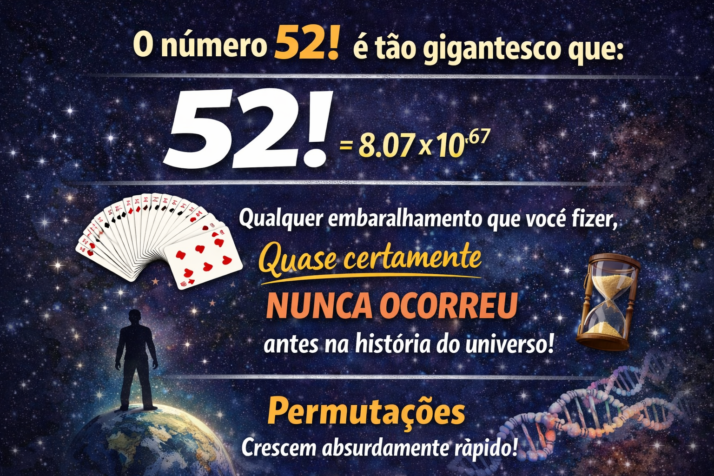
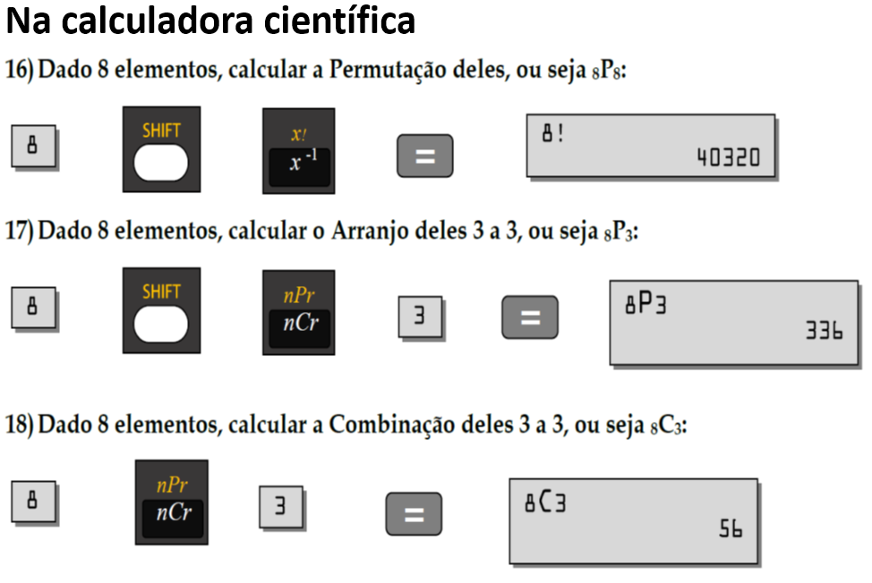

```{r setup, include=FALSE}
options(htmltools.dir.version = FALSE)
knitr::opts_chunk$set(echo=TRUE, message = FALSE, warning = FALSE, comment = "#>", fig.align = "center")
options(dplyr.print_min = 5, dplyr.print_max = 5)
```

class: middle, center, inverse

# PROBABILIDADE

---
## Probabilidade 

A Probabilidade permite analisar ou calcular as chances de obter determinado resultado diante de um experimento que dizemos aleatório. Por exemplo, qual a chance do número $5$ sair no lançamento de um dado, ou no lançamento de $4$ moedas, sair pelo menos uma face **Cara - H**.

.pull-left[
</img>]

.pull-right[
</img>]


A partir disso, a probabilidade é determinada pela razão entre o número de eventos possíveis e o número de eventos favoráveis, sendo apresentada pela seguinte expressão:

$$P(E) = \frac{\text{nº de resultados favoráveis}}{\text{nº total de resultados possíveis}}$$

onde $P(E)$ é a probabilidade de ocorrência do evento $E$.

---

### Exemplo:

Um rebanho é composto por $100$ animais, temos $20$ indivíduos doentes e $80$ sadios. 

</img>

> Qual a probabilidade de, em uma amostra aleatória simples de $5$ animais, selecionarmos $2$ animais doentes e $3$ animais sadios?

---

Para respondermos essa questão precisaremos calcular:


#### $\text{nº de resultados favoráveis}$

Ou seja, de quantas maneiras poderemos escolher $2$ animais em animais $20$ doentes e $3$ animais em $80$ animais sadios.


#### $\text{nº total de resultados possíveis}$

De quantas maneiras poderemos escolher $5$ animais (independentemente de serem sadios ou doentes) em um total de $100$ animais.

---

## Análise Combinatória e Métodos de Numeração

Portanto, para calcularmos a probabilidade do evento será necessário relembrarmos os conceitos de métodos de numeração e análise combinatória (Permutações, Arranjos e Combinações).


</img>

---


class: middle, center

# Conceitos Básicos  

## Análise Combinatória e Métodos de Numeração

---


#### Princípio Multiplicativo

O princípio fundamental da contagem, também chamado de princípio multiplicativo, postula que:

 >“quando um evento é composto por $n$ etapas sucessivas e **independentes**, de tal modo que as possibilidades da primeira etapa é $x$ e as possibilidades da segunda etapa é $y$, o número total de possibilidades do evento ocorrer é dado pelo produto $(x) \cdot (y)$”.

Em resumo, no princípio fundamental da contagem, multiplica-se o número de opções entre as escolhas que lhe são apresentadas.

---

**Exemplo**

1- Em um restaurante, há $5$ aperitivos no menu, $10$ pratos principais e $4$ sobremesas. De quantas maneiras uma refeição pode ser solicitada se um aperitivo, um prato principal e uma sobremesa forem escolhidos?

--

**Resposta:**

Dado X o número de refeições que podem ser solicitadas temos:

$$X = 5 \times 10 \times 4 = 200$$


---
#### Princípio Aditivo

> quando um evento pode ocorrer por meio de $n$ alternativas **mutuamente exclusivas**, de tal modo que a primeira pode ocorrer de $x$ maneiras e a segunda de $y$ maneiras, o número total de possibilidades do evento ocorrer é dado pela soma $x+y$.

Em resumo, no princípio aditivo, somam-se as possibilidades quando as escolhas não podem ocorrer simultaneamente (ou uma, ou outra).

---

**Exemplo**

2- Uma pessoa possui:

$10$ pares de sapatos,  
$3$ bermudas,  
$5$ calças,  
$8$ camisetas.  

Para montar um look, ela escolhe:

$1$ par de sapatos,
$1$ camiseta,
e ou $1$ bermuda ou $1$ calça (não é permitido usar ambos simultaneamente).

Pergunta:
De quantas maneiras distintas essa pessoa pode montar um look completo?

---
class: middle

3- Considere a formação de códigos de identificação para funcionários de uma empresa.
Cada código possui exatamente $5$ caracteres.  

Determine quantos códigos distintos podem ser formados em cada situação:

  (a) Utilizando apenas dígitos numéricos (0–9), sem qualquer restrição.   
  
  (b) Utilizando apenas dígitos numéricos (0–9), sendo que o primeiro dígito não pode ser 0.   
  
  (c) Utilizando apenas dígitos numéricos (0–9), sem repetição de dígitos.   
  
  (d) Utilizando um conjunto ampliado de caracteres composto por:

* $10$ dígitos (0–9),
* $52$ letras (maiúsculas e minúsculas),
* $33$ símbolos especiais,

sem qualquer restrição quanto à repetição.

---

a-

$X = 10 \times 10 \times 10 \times 10 \times 10 = 10^5 = 100.000$

--

b- 


$X = 9 \times 10 \times 10 \times 10 \times 10 = 9 \times 10^4 = 90.000$


--

c- 

$X = 10 \times 9 \times 8 \times 7 \times 6 = 30.240$


--

d) 

Sabendo que o o número de caracteres disponíveis é $10+52+33=95$, então:

$X = 95 \times 95 \times 95 \times 95 \times 95 = 95^5 = 7.737.809.375$


---

4- Um dos métodos utilizados para roubo de senhas e invasão de contas é o método de Ataque de Força-bruta ([Brute-force attack](https://en.wikipedia.org/wiki/Brute-force_attack)). Nessa técnica são testadas combinações de números, letras e caracteres especiais até que a senha seja descoberta. Suponha que um programa seja capaz de testar, em média, $435$ milhões de senhas por segundo:   

  a. qual o tempo máximo em segundos ele levaria para decodificar uma senha composta na condição (d) do exercício anterior? 

  b. qual o tempo máximo em dias ele levaria para decodificar uma senha composta na condição (d) do exercício anterior, mas com $9$ dígitos?

---

a-

$T = \frac{X}{435.000.000} =\frac{7.737.809.375}{435.000.000} = 17,79 \text{ s}$

--

b-


No caso o número de senhas será dado por $X = 95^9 = 630,25 \times 10^{15}$


Em segundos: $T = \frac{X}{435.000.000} =\frac{630,25 \times 10^{15}}{435.000.000} = 1.448.849.218 \text{ s}$


Em dias: $T = \frac{1.448.849.218}{3600 \times 24} =  16769.09 \text{ dias}$


Em anos: $T = \frac{16769.09}{365.5} =  45,95 \text{ anos}$

---
## Permutações

Quando estamos preocupados em responder "de quantas maneiras um evento pode ocorrer", utilizamos o conceito de permutação para essa tarefa. 

Digamos que temos $n$ objetos diferentes, de quantas maneiras podemos **dispor** (**permutar**) esses objetos? 

Dado o conjunto de letras $L=\{a, b, c\}$, de quantas maneiras podemos permutá-las?

--

${a,b,c}$     
${a,c,b}$  
${b,a,c}$     
${b,c,a}$  
${c,a,b}$     
${c,b,a}$  

--

Equivale em colocar os elementos dentro de caixas com $n$ compartimentos em alguma ordenação. 

E como consequência do princípio da multiplicação, as possibilidades de inserção dentro dentro de uma caixa são multiplicadas pelas possibilidades da caixa seguinte, e assim sucessivamente, ou seja:

---

## Diagrama da Permutação

```{r,out.width = "70%",fig.cap="",fig.align = 'center', echo=FALSE}
knitr::include_graphics("https://arpanosso.github.io/estatinfo/slides/img/caixa_permuta.png")
```

$$n! = n \cdot (n-1) \cdot (n-2) \cdots (2) \cdot (1)$$
$$3! = 3 \cdot (3-1) \cdot(3-2) = 3 \cdot 2 \cdot 1 = 6$$
---

**Exemplos**:

5- Quantos números de $7$ algarismos **distintos** podem ser formados com os algarismos $1,2,3,4,5,6,7$?

6- Quantos números de $7$ algarismos **distintos** podem ser formados com os algarismos $1,2,3,4,5,6,7$ de modo que em todos os números formados, o algarismo $6$ seja imediatamente seguido pelo algarismo $7$?

7- Considere um grupo de $12$ torcedores, todos distintos, distribuídos conforme o time para o qual torcem:

$3$ torcedores do Santos (S);  
$4$ torcedores do Palmeiras (P);  
$5$ torcedores do Corinthians (C).  

Esses torcedores serão dispostos em uma fila, de modo que torcedores do mesmo time permaneçam consecutivos. Determine o número de disposições lineares possíveis, sabendo que o primeiro bloco da fila deve ser formado pelos torcedores do Santos.

8-Considere um baralho padrão com $52$ cartas distintas, qual o número de maneiras de embaralhar completamente esse baralho?


---

5-  
$X = n! = 7! = 5400$

6-  
$X = n! = 6! = 720$

7-  

$X = \text{S x P x C + S x C x P} = 3!\times4!\times5!+3!\times5!\times4! = 34560$
---
8-  
$X = 52! = 8,05 \times 10^{67}$

Se você embaralhasse $1$ vez por segundo desde o início do universo (~
$10^{17}$ segundos), teria feito cerca de $10^{17}$ embaralhamentos — infinitamente menor que $10^{67}$.

Mesmo que toda a população da Terra (~
$8×10^9$) embaralhasse cartas sem parar, $1$ vez por segundo, ainda assim:

$$8×10^9×10^{17}=8×10^{26}$$

→ ainda muito menor que $10^{67}$.

É tão grande que:

A chance de dois embaralhamentos aleatórios resultarem na mesma ordem é praticamente zero.
---
class: middle, center, inverse


---
## Arranjos

O arranjo é uma extensão do conceito de fatorial de modo que, se temos $n$ e vamos tomar $x$ elementos desses $n$ (sempre com $0<x<n$), de quantas maneiras poderemos **dispor** os $x$ elementos amostrados? É uma amostragem seguida de uma permutação com os $x$ elementos escolhidos.

Nesse caso, **a ordem** com a qual os elementos serão dispostos **IMPORTA** para a contagem.

```{r,out.width = "90%",fig.cap="",fig.align = 'center', echo = FALSE}
knitr::include_graphics("https://arpanosso.github.io/estatinfo/slides/img/caixa_arranjo.png")
```


$$A^n_x= \frac{n!}{(n-x)!}$$

---

9- A senha da sua conta bancária pode ser formada de $6$ números ou de $4$ números dentre os números de $0$ a $9$, dependendo do banco. Os gerentes sempre aconselham utilizar todos os números distintos (sem repetição),

Quantas senhas podem ser formadas em um banco $6$ números, e em um banco que utiliza $4$ números, seguindo o conselho dos gerentes?

10- Quantos números de $3$ algarismos podemos formar com os dígitos $1, 2, 3, 4, 5, 6$ de modo que haja pelo menos dois dígitos iguais?

---
9 -

$$A^n_x= \frac{n!}{(n-x)!}= \frac{10!}{(10-6)!} = \frac{10.9.8.7.6.5.4!}{4!} = 151200$$
$$A^n_x= \frac{n!}{(n-x)!}= \frac{10!}{(10-4)!} = \frac{10.9.8.7.6!}{6!} = 5040$$
10 - 
$$A^n_x= \frac{n!}{(n-x)!}= \frac{6!}{(6-3)!} = \frac{6.5.4.3!}{3!} = 120$$
---

## Combinações 

Semelhante aos arranjo, nas **Combinações** temos $n$ elementos e vamos amostrar $x$ elementos $(0<x<n)$, e estamos interessados em contar de quantas maneiras poderemos **combinar** os $x$ elementos amostrados, nesse caso **a ordem** com a qual os elementos são amostrados **NÃO IMPORTA** para a contagem.


---

```{r,out.width = "100%",fig.cap="",fig.align = 'center', echo=FALSE}
knitr::include_graphics("https://arpanosso.github.io/estatinfo/slides/img/caixa_combin.png")
```


Assim, para calcularmos essa combinação, será necessário descontar dos Arranjos de $x$ elementos as permutações desses mesmos $x$ elementos, para isso, basta dividirmos os Arranjos por $x!$:

---
Portanto:

$$C^n_x=\frac{A^n_x}{x!}$$

$$C^n_x=\frac{\frac{n!}{(n-x)!}}{x!}$$
$$C^n_x=\frac{n!}{(n-x)!} \cdot \frac{1}{x!}$$

$$C^n_x= \frac{n!}{x!(n-x)!}$$
Essa forma é tão corriqueira que adotamos a seguinte denotação para a Combinação:

$$C^n_x={n \choose x} = \frac{n!}{x!(n-x)!}$$
---



---

### Exemplo

Voltando para o exemplo do rebanho composto por $100$ animais, onde temos $20$ indivíduos doentes e $80$ sadios, vamos calcular a probabilidade de em uma amostra de $5$ animais selecionarmos $2$ animais doentes e $3$ animais sadios:

</img>

$$P(E) = \frac{\text{nº de resultados favoráveis}}{\text{nº total de resultados possíveis}}$$
---

#### $\text{nº de resultados favoráveis}$

Ou seja, de quantas maneiras poderemos escolher $2$ animais do total de $20$ doentes e $3$ animais dos $80$ sadios

$C^{20}_2 \cdot C^{80}_3 = {20 \choose 2} \times {80 \choose 3}$

$C^{20}_2 \cdot C^{80}_3  = \frac{20!}{2!(20-2)!} \times \frac{80!}{3!(80-3)!}$

$C^{20}_2 \cdot C^{80}_3  = 190 \times 82160$

$C^{20}_2 \cdot C^{80}_3  = 15610400$
---

#### $\text{nº total de resultados possíveis}$

Devemos calcular agora de quantas maneiras poderemos escolher $5$ animais (independente de serem sadios ou doentes) em um total de $100$ animais.

$C^{100}_5 = {100 \choose 5}$

$C^{100}_5 = \frac{100!}{5!(100-5)!}$

$C^{100}_5  = 75287520$

---

Finalmente, a probabilidade do evento, amostrar $2$ indivíduos doentes e $3$ sadios será:

$$P(E) = \frac{\text{nº de resultados favoráveis}}{\text{nº total de resultados possíveis}} = \frac{15610400}{75287520}=0,20734 \text{ ou } 20,73\%$$

Agora que temos uma fórmula, podemos calcular a probabilidade de na amostragem de $5$ animais tomarmos:

a) nenhum animal doente (todos sadios).  
b) $01$ doente e $04$ sadios.  
c) $02$ doentes e $03$ sadios.  
d) $03$ doentes e $01$ sadio.  
e) todos doentes.

---

## Distribuição de Probabilidade 

Essa fórmula que acabamos de encontrar decreve uma ditribuição discreta de probabilidade, conhecida na estatística como  **Distribuição Hipergeométrica**. 

Considere uma população com $N$ objetos nos quais $M$ são classificados como do tipo $A$ e $N−M$ são classificados como do tipo $B$. Tomamos uma amostra ao acaso, sem reposição e não ordenada de $r$ objetos. Seja $X$ a variável que conta o número de objetos classificados como do tipo $A$ na amostra. Então a distribuição de probabilidade de $X$ será dada por:

$$P(X = x) = \frac{ {M \choose x} \cdot { {N-M} \choose {r - x} } } { {N \choose r}}$$
Assim, vamos construir essa distribuição probabilidades.

```{r,echo=TRUE,eval=FALSE,echo=FALSE}
N = 100 # Número total de elementos na população
M = 20 # número total de elementos de interesse (doentes) na população
r = 5 # tamanho da amostra.
x=0:r # os possiveis valores de doentes na amostra.
px<-dhyper(x,M,N-M,r) # função que faz a distribuição hipergeométrica
barplot(px,names=x,col="lightblue",las=1,ylim=c(0,0.5),
        xlab="nº de doentes na amostra",ylab="P(X=x)",main="X~Hgeo(20,100,5)")
text(1:length(x),px+.05,round(px*100,2))
```

---
class: middle, center
#### Distribuição Hipergeométrica


.pull-left[
```{r,echo=FALSE}
N = 100 # número total de elementos
M = 20 # número total de elementos de interesse (doentes)
r = 5 # tamamho da amostra
x=0:r # os possiveis valores de doentes na amostra
px<-dhyper(x,M,N-M,r) # função que faz a distribuição hipergeométrica
barplot(px,names=x,col="lightblue",las=1,ylim=c(0,0.5),
        xlab="nº de doentes na amostra",ylab="P(X=x)",main="X~Hgeo(20,100,5)")
text(seq(.7, length(x)+1, 1.2),px+.05,round(px,2))
```
]

.pull-right[
```{r, echo=FALSE}
tibble::tibble(x,px) 
```

]

**OBS**: O número de doentes da amostra de $5$ animais pode variar de $0$ a $5$, denominado espaço amostral ($\Omega$ ou $S$), com a soma de suas probabilidades igual a $1$:

$\sum \limits_{x=0}^r P(x_i) = 1$


---
class: middle, center

# Conceitos Básicos  

## Teoria dos Conjuntos 

---
## Definições

**Conjuntos**: é uma coleção de qualquer tipo de objetos – pessoas, animais, plantas, fenômenos, estímulos, respostas, traços genéticos, métodos, ideias e possibilidades lógicas. Dizemos que um conjunto está bem definido quando está claro que um objeto pertence ou não pertence ao conjunto. A ambiguidade não é permitida. 

- Conjunto dos números $2$, $3$, $5$, $7$.
- Conjunto de estudantes presentes na sala de aula.
- Conjunto de meses que se iniciam pela letra $J$.
- Conjunto dos números pares.
- Conjunto de árvores presentes na sala de aula.

---

**Elemento (ou membro)**: é o nome que se dá a cada objeto do conjunto. 


**Conjunto finito**: contém um número finito de elementos. 
- Conjunto dos números $2$, $3$, $5$, $7$.
- Conjunto de estudantes presentes na sala de aula.
- Conjunto de meses que se iniciam pela letra $J$.


**Conjunto infinito**: contém um número infinito de elementos. 
	Conjunto de números pares.


**Conjunto vazio**: não contém elementos
	Conjunto de árvores dentra da sala de aula.

---

### Notações e Símbolos

**Conjuntos**: São representados por letras maiúsculas tais como $A, B, C,...$


**Elementos**: São representados por letras minúsculas tais como $a, b, c,...$ 


**Conjunto vazio**: é representado pelo zero cortado por uma barra.  É aquele desprovido de elementos.

$$\phi$$ 
ou
$$\{\}$$


---

### Formas de apresentação 

**Forma Tabular**: Os elementos de um conjunto são reunidos por chaves. 
Conjunto dos números 2,3,5,7:

$A=\{2,3,5,7\}$

**Forma de construção**: Para conjuntos grandes devemos caracterizar seus elementos por meio de afirmações matemáticas, pois, por exemplo, somos incapazes de relacionar todos os números maiores que $5$, uma vez que este conjunto é infinito, assim, introduzimos um elemento variável, $x$, e definimos como  $Z = \{ x | x > 5\}$, lê-se "o conjunto de todo os números $x$ tal que, $x$ seja maior que $5$".


Para o exemplo anterior, temos:

$A=\{x|x \text{ é nº primo menor que 10} \}$ 


> **OBS:** Um número primo é um número natural maior que $1$ que só pode ser dividido por $1$ e por ele mesmo, sem deixar resto. 
---

**Conjunto solução**: A teoria dos conjuntos pode ser utilizada para apresentar as soluções de problemas matemáticos. Por exemplo:

$A = \{ x | x^2 = 4\}$  então, $A = \{ -2, 2 \}$


$B = \{t | 3t – 4 = 5\}$  então, $B = \{3\}$


$C=\{x | x^2 < 4\}$  então  $C=\{x | -2 < x < 2\}$

---

## Pertinência

Para indicar que um objeto é elemento de um conjunto, usamos o símbolo de pertinência $\in$, lido como "pertence a" ou "está em". 

$$a \in T$$

significa que **"a é elemento do conjunto T"** ou **"a pertence a T"**. 

O oposto pode ser expresso por $\notin$, significando **"não é elemento"** ou **"não pertence a"**. 

$$ 5 \in \aleph$$

$$\frac{1}{2} \in \Re$$

$$\frac{1}{2} \notin \aleph$$

---

## Continência

**Subconjunto**: Para um conjunto $A$ contendo somente elementos de um conjunto $B$, mas não necessariamente todos os membros de $B$, então $A$ é **subconjunto** de $B$.

$$ A \subset B$$
ou $B$ é **superconjunto** de $A$.

$$B \supset A$$

E dizemos que **"A está contido em B"** ou **"B contém A"**.

Essa definição de subconjunto nos permite dizer que um conjunto é subconjunto de si mesmo:

$$B \subset B$$
O conjunto vazio é considerado subconjunto de qualquer conjunto, isto é 

$$\phi \subset A$$

---

**Igualdade entre conjuntos**: Dois conjuntos são ditos iguais, em símbolos:

$$A = B$$

se, e somente se:

$$A \subset B \text{ e } A \supset B $$

Os conjuntos contiverem exatamente os mesmos elementos.

Se $x$ for um elemento, então $x \in A$ implica que $x \in B$ e vice-versa.

de forma análoga, se $x \notin A$ implica que $x \notin B$ 

**Exemplo**

$$\{1, 2, 3\} = \{3, 1, 2\} = \{1, 2, 2, 3\}$$
**OBS:** O número de elementos do conjunto não é considerado para a operação de igualdade entre eles.

---

**Conjunto Universo ou universal**: Formado por todos os elementos que têm uma característica desejada:

Notação: $U$ ou $\mho$:

$$U \supset A \supset \phi, \forall  A$$
> Lê-se: O universo contém o conjunto A, que por sua vez contém o conjunto vazio, qualquer que seja o conjunto A.

**Conjunto potência** ou **conjunto das partes**: Seja $A$ um conjunto finito, define-se o conjunto das partes de $A$ ou conjunto potência como sendo o conjunto cujos elementos são todos os possíveis subconjuntos formados com os elementos de $A$:

Notação $P(A) = 2^n = a$ on de $n$ é o número de elementos do conjunto $A$:

**Exercício**: 

Se $B = \{1, 2, 3\}$ qual o conjunto potência de $B$?

---

Subconjunto desprovido de elementos = $\phi$  
Subconjunto com $1$ elementos ={1}; {2}; {3}  
Subconjunto com $2$ elementos= {1, 2}; {1, 3}; {2, 3}  
Subconjunto com $3$ elementos é o próprio conjunto B =  {1, 2, 3}  

$$P(B) = \{\phi,\{1\}, \{2\}, \{3\}, \\ \{1, 2\},  \{1, 3\}, \{2, 3\}, \{1, 2, 3\}\}$$


Observe que  $"3"$  é diferente de  $"\{3\}"$ , pois $3$ é um elemento e $\{3\}$ é um conjunto. 

Podemos dizer que:

 $\{3\} \subset \{ 1, 2, 3\}$, porém $3 \in \{1, 2, 3\}$
 
 Assim como podem dizer que $\{3\}  \in P(B)$
 
  
---

**Conjuntos Disjuntos**: São aqueles que não têm elementos comum, ou seja, $A \neq B$.


$A={1,2,3}$ e $B={4,5,6}$, assim *A e B são disjuntos*.  

$A={1,3}$ e $B={x}$, assim *A e B são disjuntos*.  

$A={2,3}$ e $B={4,3}$, assim *A e B não são disjuntos*.  


---

## Diagrama de Venn-Euler

Conjuntos de qualquer tipo de elementos são representados por conjunto de pontos. Para simplificação das relações, são utilizados pontos em um **círculo** ou em um **retângulo**. 

Tal representação é chama de **Diagrama de Venn-Euler** que são representações geométricas de conjuntos e seus elementos bem como das relações destes conjuntos.

```{r,out.width = "45%",fig.cap="",fig.align = 'center',echo=FALSE}
knitr::include_graphics("https://arpanosso.github.io/estatinfo/slides/img/venn_01.png")
```

---

## Operações com conjuntos

### União ou Reunião (OU)

Com dois conjuntos $A$ e $B$, podemos sempre formar um novo conjunto simplesmente pelo agrupamento de seus elementos. Chamamos a esse novo conjunto de união, e escrevemos simbolicamente:

$$A \cup B$$

Lemos **"A União B"** ou **"A Reunião B"**, ou seja, esse novo conjunto contém exatamente os elementos que estão em $A$, ou os elementos que estão em $B$, ou os elementos que estão **ambos**. 

A operação de União assemelha-se à adição. Entretanto, devemos observar que:

i) $A \cup A = A$

ii) $B \subset A$, então: $A \cup B = A$

---

class: middle, center

Diagrama de Venn da união de dois conjuntos disjuntos:

```{r,out.width = "80%",fig.cap="",fig.align = 'center',echo=FALSE}
knitr::include_graphics("https://arpanosso.github.io/estatinfo/slides/img/venn_02.png")
```

$$A \cup B = \{x| x \in A \text{ ou  } x \in B  \text{ ou }  (x \in A \text{ e  } x \in B)  \}$$
---

class: middle, center

Diagrama de Venn da união de dois conjuntos não disjuntos:

```{r,out.width = "80%",fig.cap="",fig.align = 'center',echo=FALSE}
knitr::include_graphics("https://arpanosso.github.io/estatinfo/slides/img/venn_03.png")
```

$$A \cup B = \{x| x \in A \text{ ou  } x \in B  \text{ ou }  (x \in A \text{ e  } x \in B)  \}$$

---

class: middle, center

$$A \cup A = A \text{ e se } B \subset A,\text{ então: } A \cup B = A$$

```{r,out.width = "80%",fig.cap="",fig.align = 'center',echo=FALSE}
knitr::include_graphics("https://raw.githubusercontent.com/arpanosso/estatinfo/master/slides/img/venn_04.png")
```

---

### Propriedades da União

i) Comutativa:

$A \cup B = B \cup A$


ii) Associativa:

$A \cup (B \cup C) = (A \cup B) \cup C = (A \cup B \cup C)$


iii) União com o vazio:

$A \cup \phi = \phi \cup A = A, \forall A$


iv) União com o Universo:

$A \cup U = U \cup A = U, \forall A$

---

### Interseção (E)

Em analogia, imaginemos duas retas que se interceptam, as duas retas podem ser consideradas como conjuntos infinitos de pontos. Os dois conjuntos têm um ponto em comum o ponto de interseção. 

```{r,echo=FALSE, out.width="60%"}
x<-1:100
y<- x*1+3
z<- -x*1 + 100
plot(x,y,type="l",col="red",las=1)
points(x,z,type="l",col="blue")
```

---

Generalizando, sejam $A$ e $B$ dois conjunto quaisquer, podemos estar interessados em saber  se os dois conjuntos estão sobrepostos, isto é, se os dois conjuntos possuem elementos em comum, seja ele vazio ou não, a interseção de $A$ e $B$ escrevemos: 

$$A \cap B $$

Lemos **"A interseção B"**, ou **"A inter B"**.

```{r,out.width = "60%",fig.cap="",fig.align = 'center',echo=FALSE}
knitr::include_graphics("https://raw.githubusercontent.com/arpanosso/estatinfo/master/slides/img/venn_05.png")
```

$$A  \cap B = \{x|x \in A \text{ e  } x \in B \}$$

---

class: middle, center

```{r,out.width = "80%",fig.cap="",fig.align = 'center',echo=FALSE}
knitr::include_graphics("https://raw.githubusercontent.com/arpanosso/estatinfo/master/slides/img/venn_06.png")
```


Neste caso, quando dois conjuntos não possuem elementos em comum, então $D$ é um conjunto vazio, os dois conjuntos são então chamados de **disjuntos**.

---

### Propriedades da Interseção

i) Comutativa:

$A \cap B = B \cap A$

ii) Associativa:

$A \cap (B \cap C) = (A \cap B) \cap C = (A \cap B \cap C)$

iii) Interseção com o vazio:

$A \cap \phi = \phi \cap A = \phi, \forall A$

iv) iii) Interseção com o universo:

$A \cap U = U \cap A = A, \forall A$

---

**Operações com conjuntos**

1) Primeira Lei Distributiva:

$A \cap (B \cup C) = (A \cap B) \cup (A \cap C)$

2) Segunda Lei Distributiva 

$A \cup (B \cap C) = (A \cup B) \cap (A \cup C)$

---

class: middle, center

1) Primeira Lei Distributiva  


```{r,out.width = "90%",fig.cap="",fig.align = 'center',echo=FALSE}
knitr::include_graphics("https://raw.githubusercontent.com/arpanosso/estatinfo/master/slides/img/venn_07.png")
```

Dados $3$ conjuntos, $A$, $B$ e $C$, podemos demonstrar que:
$A \cap (B \cup C) = (A \cap B) \cup (A \cap C)$

---

class: middle, center

2) Segunda Lei Distributiva  


```{r,out.width = "90%",fig.cap="",fig.align = 'center',echo=FALSE}
knitr::include_graphics("https://raw.githubusercontent.com/arpanosso/estatinfo/master/slides/img/venn_08.png")
```


Dados $3$ conjuntos, $A$, $B$ e $C$, podemos demonstrar que:
$A \cup (B \cap C) = (A \cup B) \cap (A \cup C)$

---

## Conjunto Complementar

**Conjunto Complementar**: Seja $A$ um subconjunto de $U$, isto é $A \subset U$. Então estamos interessados nos elementos de $U$ que não pertencem a $A$. Eles formam um novo conjunto, que é chamado **"o complementar de A em U"**. Representado por: $\bar{A}$ ou $A^{c}$.


```{r,out.width = "55%",fig.cap="",fig.align = 'center',echo=FALSE}
knitr::include_graphics("https://raw.githubusercontent.com/arpanosso/estatinfo/master/slides/img/venn_09.png")
```
$$\bar{A} = \{ x | x \in U, x \notin A \}$$
---

Definido a operação de interseção, observe que se $A$ for um subconjunto de um conjunto universo $U$ e $\bar{A}$ o  complemento de $A$, então: 

i) $A \cap \bar{A} = \phi, \forall A$

ii) $A \cup \bar{A} = U, \forall A$

---

Utilizando o diagrama de Venn pode-se provar as propriedades:

$a) \bar{(A \cap B)} = \bar{A} \cup \bar{B}$

$b) \bar{(A \cup B)} = \bar{A} \cap \bar{B}$

---

$\bar{(A \cap B)} = \bar{A} \cup \bar{B}$

```{r,out.width = "90%",fig.cap="",fig.align = 'center',echo=FALSE}
knitr::include_graphics("https://raw.githubusercontent.com/arpanosso/estatinfo/master/slides/img/venn_10.png")
```

---

$\bar{(A \cup B)} = \bar{A} \cap \bar{B}$

```{r,out.width = "90%",fig.cap="",fig.align = 'center',echo=FALSE}
knitr::include_graphics("https://raw.githubusercontent.com/arpanosso/estatinfo/master/slides/img/venn_12.png")
```

---

### Exercícios

1) Em uma  sala de aula  há $30$ meninas, $21$ crianças ruivas, $13$ meninos não ruivos e $4$ meninas ruivas. Pergunta-se:  

a) Quantos são os meninos ruivos?  
b) Quantas são as meninas não ruivas?  
c) Quantas crianças há na escola?  
d) Quantas crianças são ruivas ou meninas?  
e) Quantas crianças não são ruivas ou meninas?  
f) Quantas crianças não são, ruivas ou meninas?  

---

2) Em uma comunidade de animais são consumidas $3$ espécies de plantas $A$, $B$ e $C$. Uma pesquisa apresentou os seguintes resultados:

```{r,out.width = "95%",fig.cap="",fig.align = 'center',echo=FALSE}
knitr::include_graphics("https://raw.githubusercontent.com/arpanosso/estatinfo/master/slides/img/ex2_aula6.png")
```

a) Quantos animais foram amostrados?  
b) Quantos animais consomem somente $2$ espécies de plantas?  
c) Quantos animais não consomem a planta $B$?  
d) Quantos animais não consomem $A$ ou não consomem $B$?  

---
### Respostas

```{r,out.width = "85%",fig.cap="",fig.align = 'center',echo=FALSE}
knitr::include_graphics("https://raw.githubusercontent.com/arpanosso/estatinfo/master/slides/img/aula6_respostas.png")
```
