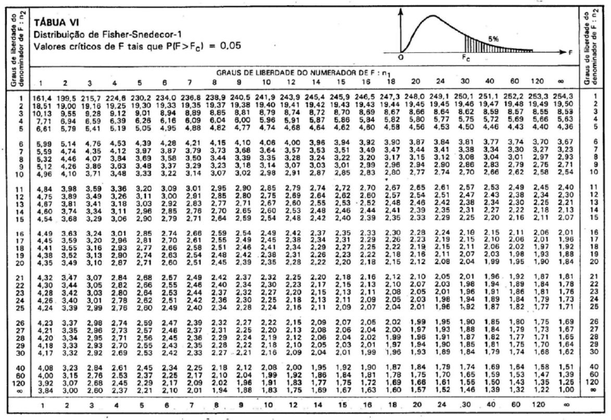

```{r setup, include=FALSE}
options(htmltools.dir.version = FALSE)
knitr::opts_chunk$set(echo=TRUE, message = FALSE, warning = FALSE, comment = "#>", fig.align = "center")
options(dplyr.print_min = 5, dplyr.print_max = 5)
```


class: middle, center, inverse

# Teste de Hipótese

---

## Teste de Hipótese

**Objetivo**: decidir se uma afirmação, em geral, sobre **parâmetros** de uma ou mais populações é, ou não verdadeira, apoiado por evidências obtida de dados amostrais. 


Tal afirmação é o que se chama **Hipótese Estatística** e a regra usada para decidir se ela é verdadeira ou não, é o **Teste de Hipóteses**. 

---
**Exemplo 1**.  Uma empresa utiliza uma estratégia de marketing digital $A$ que resulta em uma média de $500$ vendas mensais, com desvio padrão populacional de $(\sigma = 25)$ vendas. Uma agência de marketing afirma que sua nova estratégia $B$ pode elevar esse número para $510$ vendas mensais $(\sigma = 25)$ vendas. 


---

```{r,echo=FALSE}
library(ggplot2)

dados <- data.frame(
  x = seq(425, 575, by = 0.1)
)

ggplot(dados, aes(x)) +
  stat_function(
    fun = dnorm,
    args = list(mean = 500, sd = 25),
    aes(color = "Estratégia A"),
    linewidth = 1.3
  ) +
  stat_function(
    fun = dnorm,
    args = list(mean = 510, sd = 25),
    aes(color = "Estratégia B"),
    linewidth = 1.3
  ) +
  geom_vline(
    xintercept = c(500,510),
    linetype = "dashed",
    linewidth = 0.8
  ) +
  annotate(
    "text",
    x = 485,
    y = 0.0005,
    label = "mu[A]==500",
    parse = TRUE
  ) +
  annotate(
    "text",
    x = 525,
    y = 0.001,
    label = "mu[B]==510",
    parse = TRUE
  ) +
  scale_color_manual(
    values = c(
      "Estratégia A" = "#1F77B4",
      "Estratégia B" = "#D62728"
    )
  ) +
  labs(
    title = "",
    subtitle = "",
    x = "Número médio de vendas",
    y = "Densidade",
    color = NULL
  ) +
  theme_minimal(base_size = 14) +
  theme(
    legend.position = "bottom",
    plot.title = element_text(face = "bold")
  )
```


---
Considerando uma amostra de $50$ períodos de veiculação da nova campanha de marketing $(B)$, deve-se ou não adotar essa campanha, admitindo-se como resultado uma média de $504$ vendas por período $(\bar{X})$, fixando-se $\alpha=5\%$.

```{r,echo=FALSE,fig.width=10,fig.height=6}
library(ggplot2)

n <- 50
se <- 25/sqrt(n)

dados <- data.frame(
  x = seq(485, 525, by = 0.01)
)

ggplot(dados, aes(x)) +

  stat_function(
    fun = dnorm,
    args = list(mean = 500, sd = se),
    aes(color = "H0: μ = 500"),
    linewidth = 1.3
  ) +

  stat_function(
    fun = dnorm,
    args = list(mean = 510, sd = se),
    aes(color = "H1: μ = 510"),
    linewidth = 1.3
  ) +

  geom_vline(
    xintercept = c(500, 510),
    linetype = "dashed",
    linewidth = 0.8
  ) +

  geom_segment(
    aes(
      x = 505,
      xend = 505,
      y = 0,
      yend = dnorm(505, 510, se)
    ),
    linewidth = 1
  ) +

  annotate(
    "text",
    x = 497,
    y = 0.010,
    label = "μ1 = 500"
  ) +

  annotate(
    "text",
    x = 513,
    y = 0.010,
    label = "μ2 = 510"
  ) +

  annotate(
    "text",
    x = 505,
    y = 0.08,
    label = "Valor crítico\nx̄ = 505"
  ) +

  scale_color_manual(
    values = c(
      "H0: μ = 500" = "#1F77B4",
      "H1: μ = 510" = "#D62728"
    )
  ) +

  labs(
    title = "Distribuição da média amostral",
    subtitle = "n = 50 e σ = 25",
    x = expression(bar(X)),
    y = "Densidade",
    color = NULL
  ) +

  theme_minimal(base_size = 14) +

  theme(
    legend.position = "bottom",
    plot.title = element_text(face = "bold"),
    panel.grid.minor = element_blank()
  )
```
---
### Hipóteses estatísticas

Utilizadas em experimentos comparativos, nos quais um novo produto ou nova técnica é comparado com o padrão, para determinar se sua superioridade pode ser corroborada pela evidência experimental.

**Hipótese nula $(H_0)$:** é a hipótese de igualdade entre o novo e o produto padrão, ou seja, a designação "hipótese nula" decorre da suposição que a diferença entre eles é nula ou zero.

**Hipótese alternativa $(H_1)$:** deve ser tomada como verdadeira caso a hipótese da nulidade seja descartada.

$$\begin{cases}
H_0 = \mu = 500 \text{ vendas mensais} \\
H_1 = \mu = 510 \text{ vendas mensais}
\end{cases}$$
---

### Estatística teste

Para a tomada de decisão, deve-se extrair uma amostra aleatória (por exemplo, $n = 50$ ). Calcula-se a média amostral $\bar{x}_a$ do, no exemplo, número de vendas mensais.

Se $\bar{x}_a$ estiver próxima de $500$, **não se deve rejeitar $H_0$**, e a **conclusão** será que a estratégia $B$ é *estatisticamente* igual à estratégia $A$.

Se $\bar{x}_a$ estiver próxima ou for superior à $500$, **rejeita-se $H_0$ em favor a $H_1$** e a **conclusão**  será que a estratégia $B$ é superior à $A$ quanto ao número de ventas, tal resultado implica no fato de que a empresa poderá utilizá-la.

---

### Critério de decisão 

Para aceitar ou rejeitar $H_0$, determina-se um valor $k$ (ponto) entre $500$ e $510$, chamado valor crítico, $\bar{x}_c$.

```{r,out.width = "100%",fig.cap="",fig.align = 'center',echo=FALSE}
knitr::include_graphics("https://raw.githubusercontent.com/arpanosso/estatinfo/master/slides/img/testeH_02.png")
```

O procedimento do teste, então, divide os possíveis valores da estatística teste em dois subconjuntos: uma região de aceitação e uma de rejeição para $H_0$, o que pode levar a dois tipos de erros. 

---

Por exemplo, se o verdadeiro valor do parâmetro $\mu$ é $500$ vendas e incorretamente concluímos que $\mu = 510$ vendas,  cometeremos um erro referido como **ERRO TIPO I (falso positivo)**. 


---

Por outro lado, se o verdadeiro valor de $\mu$ é $510$ e incorretamente concluímos  que $\mu = 500$, cometeremos uma segunda espécie de erro, referido como **ERRO TIPO II (falso negativo)**.


---
## Erros tipo I e II

Situação específica na População


*Conclusão do Teste* | $H_0$ verdadeira | $H_0$ falsa
---|---:|:---|
Não Rejeita $H_0$ | Decisão correta | Erro tipo II (perdas potenciais)
Rejeitar $H_0$ | Erro tipo I (perdas reais) | Decisão Correta


$\alpha = P \text{(erro tipo I)}$ = $P$(Rejeitar $H_0|H_0$ é verdadeira) = **nível de significância** $(10\%, 5\% \text{ ou } 1\%)$.

$\beta = P \text{(erro tipo II)}$ = $P$(Não rejeitar $H_0|H_0$ é falsa) = **poder do teste** dado por $1-\beta$.

---

```{r,out.width = "110%",fig.cap="",fig.align = 'center',echo=FALSE}
knitr::include_graphics("https://raw.githubusercontent.com/arpanosso/estatinfo/master/slides/img/testeH_03.png")
```

---

```{r,out.width = "110%",fig.cap="",fig.align = 'center',echo=FALSE}
knitr::include_graphics("https://raw.githubusercontent.com/arpanosso/estatinfo/master/slides/img/testeH_04.png")
```
---

## Passos para a construção de um teste de hipóteses

a) Fixe a hipótese $H_0$  a ser testada e a alternativa $H_1$;
 
b) Use a teoria estatística e as informações disponíveis para decidir qual estatística (estimador) será usada para testar a hipótese $H_0$, obtendo-se suas propriedades (distribuição, estimativa, erro padrão);
 
c) Fixe a probabilidade $\alpha$ de cometer o **erro tipo I** e use este valor para construir a $RC$ (região crítica). Lembre-se que a $RC$ é construída para a estatística definida no passo **(a)**, usando os valores hipotetizados por $H_0$;

d) Use as informações da amostra para calcular o valor da estatística do teste;

e) Se o valor da estatística calculado com os dados da amostra não pertencer à $RC$, não rejeitamos $H_0$; caso contrário, rejeita-se $H_0$. 

---

```{r,out.width = "90%",fig.cap="",fig.align = 'center',echo=FALSE}
knitr::include_graphics("https://raw.githubusercontent.com/arpanosso/estatinfo/master/slides/img/testeH_05.png")
```

---

```{r,out.width = "90%",fig.cap="",fig.align = 'center',echo=FALSE}
knitr::include_graphics("https://raw.githubusercontent.com/arpanosso/estatinfo/master/slides/img/testeH_06.png")
```

---

```{r,out.width = "90%",fig.cap="",fig.align = 'center',echo=FALSE}
knitr::include_graphics("https://raw.githubusercontent.com/arpanosso/estatinfo/master/slides/img/testeH_07.png")
```
---
class: middle, center, inverse

# Teste sobre a média de uma população com variância conhecida

---

```{r,out.width = "120%",fig.cap="",fig.align = 'center',echo=FALSE}
knitr::include_graphics("https://raw.githubusercontent.com/arpanosso/estatinfo/master/slides/img/testeH_08.png")
```

---


```{r,out.width = "120%",fig.cap="",fig.align = 'center',echo=FALSE}
knitr::include_graphics("https://raw.githubusercontent.com/arpanosso/estatinfo/master/slides/img/testeH_09.png")
```

---


```{r,out.width = "140%",fig.cap="",fig.align = 'center',echo=FALSE}
knitr::include_graphics("https://raw.githubusercontent.com/arpanosso/estatinfo/master/slides/img/testeH_10.png")
```

---

[Tabela - Normal Padrão](https://github.com/arpanosso/estatinfo/raw/master/docs/TabelaNormalPadrao.pdf) 

```{r,out.width = "120%",fig.cap="",fig.align = 'center',echo=FALSE}
knitr::include_graphics("https://raw.githubusercontent.com/arpanosso/estatinfo/master/slides/img/hist_8.png")
```

---

```{r,out.width = "120%",fig.cap="",fig.align = 'center',echo=FALSE}
knitr::include_graphics("https://raw.githubusercontent.com/arpanosso/estatinfo/master/slides/img/testeH_11.png")
```

---

class: middle, center, inverse

# Teste para a Proporção binomial (p)

---

```{r,out.width = "110%",fig.cap="",fig.align = 'center',echo=FALSE}
knitr::include_graphics("https://raw.githubusercontent.com/arpanosso/estatinfo/master/slides/img/testeH_12.png")
```
---

**Exemplo 3**. Um laboratório de vacinas contra febre aftosa afirmou que ela imuniza $90\%$ dos animais.  Em uma amostra de $200$ animais, nos quais foram aplicados a vacina, $160$ foram imunizados. Verificar se a declaração do fabricante é verdadeira ao nível de $5\%$.

---

```{r,out.width = "90%",fig.cap="",fig.align = 'center',echo=FALSE}
knitr::include_graphics("https://raw.githubusercontent.com/arpanosso/estatinfo/master/slides/img/testeH_13.png")
```

---
class: middle, center, inverse

# Test t de Student

## Teste para a média de uma população normal com $\sigma^2$ desconhecido

---

```{r,out.width = "120%",fig.cap="",fig.align = 'center',echo=FALSE}
knitr::include_graphics("https://raw.githubusercontent.com/arpanosso/estatinfo/master/slides/img/testeH_14.png")
```

---

```{r,out.width = "110%",fig.cap="",fig.align = 'center',echo=FALSE}
knitr::include_graphics("https://raw.githubusercontent.com/arpanosso/estatinfo/master/slides/img/testeH_15.png")
```

---

**Exemplo 4**. As especificações de um dado medicamento veterinário exigem $23,2$ g de álcool etílico em sua composição. Uma amostra de $10$ análises do produto apresentou um teor médio de álcool de $23,5$ g com desvio padrão de $0,24$ g. 

Com base nessa amostra, pode-se concluir, ao nível de significância de $1\%$, que o produto satisfaz as condições exigidas $(\mu = 23,2 \text{ g })$ ?

---

[Tabela - Distribuição t-Student](https://github.com/arpanosso/estatinfo/raw/master/docs/Tabela_tdeStudent.pdf) 

```{r,out.width = "110%",fig.cap="",fig.align = 'center',echo=FALSE}
knitr::include_graphics("https://raw.githubusercontent.com/arpanosso/estatinfo/master/slides/img/ic_05.png")
```

---

```{r,out.width = "130%",fig.cap="",fig.align = 'center',echo=FALSE}
knitr::include_graphics("https://raw.githubusercontent.com/arpanosso/estatinfo/master/slides/img/testeH_16.png")
```

---
class: middle, center, inverse

# Comparações de parâmetros de duas populações

---


Suponha duas amostras aleatórias independentes de tamanhos $n_1$ e $n_2$ ou seja, $X_1 , X_2 , ..., X_{n1}$ e $Y_1 ,Y_2 , ...,Y_{n2}$, respectivamente, de uma população com distribuição $N(\mu_1, \sigma_1^2)$ e de população com distribuição $N(\mu_2, \sigma_2^2)$

### Hipóteses

$H_0: \sigma_1^2 = \sigma_2^2$ ou seja $\left(\frac{\sigma_1^2}{\sigma_2^2} = 1 \right)$ 

$H_1: \sigma_1^2 \neq \sigma_2^2$ ou seja $\left(\frac{\sigma_1^2}{\sigma_2^2} \neq 1 \right)$ 

---

### Estatística do teste:

Sendo $s_1^2$ e $s_2^2$ as variâncias, respectivamente das amostras $n_1$ e $n_2$, o quociente

$$\frac{s^2_1 / \sigma_1^2}{ s^2_2 / \sigma^2_2}$$

Segue a distribuição de $F$ (Snedecor) com $n_1-1$ e $n_2-1$ graus de liberdade $(GL)$, tem a denotação $F(n_1-1, n_2-1)$.

Sob a suposição de $H_0$ ser verdadeira, isto é, $\sigma^2_1 = \sigma^2_2$, tem-se que

$F = \frac{s^2_1}{s^2_2} \sim F(n_1-1, n_2-1)$

---

#### Construção da região crítica

Fixado $\alpha$, os pontos críticos serão $F_1$ e $F_2$ da distribuição $F$, tais que:

```{r,out.width = "80%",fig.cap="",fig.align = 'center',echo=FALSE}
knitr::include_graphics("https://raw.githubusercontent.com/arpanosso/estatinfo/master/slides/img/testeH_17.png")
```

Se $\alpha = 10\%$, pode-se, utilizando a Tabela da distribuição $F$, encontrar diretamente $F_2(5\%)$. Para encontrar $F_1(95\%)$ utiliza-se a propriedade:


$F_{(1-\alpha;\;n_1-1,\; n_2-1)} = \frac{1}{F_{(\alpha;\;n_2-1,\; n_1-1)}}$, assim: $F_{(0,95;\;n_1-1,\; n_2-1)} = \frac{1}{F_{(0,05;\;n_2-1,\; n_1-1)}}$

---

#### Exemplo: Construir a regição crítica para o caso abaixo:

Se $n_1 - 1= 5$ e $n_2-1 = 7$ dado $\alpha = 10\%$


$F2_{(0,05;\;5,\; 7)} = 3,97$ olhamos na tabela

---
[Tabela - Distribuição F-Snedecor](https://github.com/arpanosso/estatinfo/raw/master/docs/TabelaFSnedecor.pdf) 



---

F1 precisamos calcular:

$F1_{(0,95;\;5,\; 7)} = \frac{1}{F_{(0,05;\;7,\; 5)}}=\frac{1}{4,88} = 0,205$


Assim, $RC = \{0 < F < 0,205 \text{ ou }  F > 3,97 \}$

---

Entretanto, o procedimento que se usa na prática é calcular $F$ utilizando sempre a maior variância no numerador $s_1^2 > s^2_2$ portanto $F > 1$, e considerar o ponto crítico $F_{2(\alpha;\;n1-1,\; n2-1)}$.

**Amostra:** Colhidas amostras aleatórias $n_1$ e  $n_2$, calcula-se $s^2_1$ e $s^2_2$ com $(s^2_1 > s^2_2)$, então:

$$F_{obs} = \frac{s^2_1}{s^2_2} \sim F_{(n_1-1;n_2-1)}$$

**Conclusão:** Se $F_{obs} \in RC$, **rejeita-se** $H_0$, no caso contrário, **não se rejeita** $H_0$.

---

**Exemplo**. Dois grupo de $8$ animais da mesma idade e raças diferentes foram submetidos a um mesmo regime alimentar. Os resultados para ganho de peso foram:

| | | | | | | | 
---| ---|--- | ---| ---|--- |--- |--- | 
**R1:** | $2,30$   | $2,10$   | $1,91$   | $1,20$   | $1,93$   | $1,88$   | $1,95$   | $2,10$
**R2:** | $2,30$   | $2,15$   | $2,00$   | $1,28$   | $2,15$   | $2,20$   | $1,91$   | $2,06$

Ao nível de $5\%$, as variâncias dos ganhos de pesos raças diferem entre si?

---

```{r}
r1<-c(2.30,2.10,1.91,1.20,1.93,1.88,1.95,2.10)
r2<-c(2.30,2.15,2.00,1.28,2.15,2.20,1.91,2.06)
var.test(r1,r2)
```

---

Testar as hipóteses:

$$
\begin{cases}
H_0: \sigma_{r1}^2 = \sigma_{r2}^2 \\
H_1: \sigma_{r1}^2 \neq \sigma_{r2}^2
\end{cases}
$$
Calculando os valores de variância para as duas raças:

$s_{r1}^2 = 0,10433$ 

e  

$s_{r2}^2 = 0,10068$

sendo que $n_{r1} = n_{r2} = 8$ 

e $\alpha = 5\%$


A estatística do teste: $\frac{s_{r1}^2}{s_{r2}^2} = \frac{0,10433}{0,10068} = 1,03618$

---
$F_{c(0,05; 7, 7)} = 3,79$ assim, $RC = \{  F > 3,79 \}$
```{r,echo=FALSE}
curve(df(x,7,7),0,7,xlab="t",ylab="d",
      main="F(7,7)")
abline(v=1.03618,col="red",lty=2)
segments(3.79,-1,3.79,df(3.79,7,7))
text(1.5,0,"Fobs",col="red")
text(5,0,"RC",col="black")
```


Como $F_{obs} \notin RC$ não se rejeita $H_0$, ou seja, as variâncias são estatisticamente iguais ao nível de 5% de significância, ou seja, as variâncias dos ganhos de peso das raças são homocedásticas.

---

### Comparação de duas médias de populações normais: amostras independentes

A análise da hipótese da igualdade de variâncias é crucial para o uso do teste *t*, na comparação de duas médias, apresentado a seguir.

Com o objetivo de se comparar duas populações examinaremos a situação na qual os dados estão na forma de realizações de amostras aleatórias de tamanhos $n_1$ e $n_2$, selecionadas, respectivamente, das populações $1$ e $2$. 

Uma coleção de $n_1 + n_2$ elementos são aleatoriamente divididos em $2$ grupos de tamanhos $n_1$ e $n_2$, onde cada membro do primeiro grupo recebe o tratamento $1$ e do segundo, o tratamento $2$. Especificamente, estaremos interessados em fazer inferência sobre o parâmetro:

$\mu_1 - \mu_2$ = (média da população 1) – (média da população 2)

**Hipótese:** $H_0: \mu_1 = \mu_2$ ou seja, $\mu_1 - \mu_2 = 0$

**Estatística do teste:** $Z = \frac{(\bar{X}-\bar{Y})-(\mu_1-\mu_2)}{\sqrt{\frac{\sigma^2_1}{n_1} + \frac{\sigma^2_2}{n_2}}} \sim N(0,1)$

---

#### Caso 1: variâncias conhecidas

$Z = \frac{(\bar{X}-\bar{Y})}{\sqrt{\frac{\sigma^2_1}{n_1} + \frac{\sigma^2_2}{n_2}}} \sim N(0,1)$

#### Caso 2: variâncias desconhecidas e iguais

Preliminarmente, testa-se se as variâncias das duas populações são iguais. Caso a hipótese não seja rejeitada, isto é, que $\sigma_1^2=\sigma_2^2=\sigma^2$, a estatística anterior transforma-se em:

$Z = \frac{(\bar{X}-\bar{Y})}{\sigma\sqrt{\frac{1}{n_1} + \frac{1}{n_2}}}$ , substituimos $\sigma$ por um estimador, teremos uma expressão muito semelhante à $t$ de Student. Uma estatística para $\sigma^2$ é a média ponderada:

$S_P^2 = \frac{(n_1-1)s_1^2+(n_2-1)s^2_2}{(n_1-1)+(n_2-1)}$

que, como $s^2_1$ e $s^2_2$ são dois estimadores não viciados de $\sigma^2$, também é um estimador não viciado de $\sigma^2$.

Assim, $t = \frac{(\bar{X} - \bar{Y})}{s_p\sqrt{\frac{1}{n_1}+\frac{1}{n_2}}} \sim t(n_1+n_2 - 2) GL$
---


**Exemplo**. Dois grupo de $8$ animais da mesma idade e raças diferentes foram submetidos a um mesmo regime alimentar. Os resultados para ganho de peso foram:

| | | | | | | | 
---| ---|--- | ---| ---|--- |--- |--- | 
**R1:** | $2,30$   | $2,10$   | $1,91$   | $1,20$   | $1,93$   | $1,88$   | $1,95$   | $2,10$
**R2:** | $2,30$   | $2,15$   | $2,00$   | $1,28$   | $2,15$   | $2,20$   | $1,91$   | $2,06$

Ao nível de $5\%$, as médias dos ganhos de pesos raças diferem entre si?

---

```{r}
r1<-c(2.30,2.10,1.91,1.20,1.93,1.88,1.95,2.10)
r2<-c(2.30,2.15,2.00,1.28,2.15,2.20,1.91,2.06)
t.test(r1, r2, alternative = "le", var.equal = TRUE)
```

---

Usando os dados do exemplo anterior, testar se há evidência de que as duas raças
apresentam o mesmo ganho de peso $(H_0: \mu_A = \mu_B \text{ vs. } H_1: \mu_A < \mu_B)$, ao nível de $5\%$.


$$
\begin{cases}
H_0: \mu_{r1} = \mu_{r2} \\
H_1: \mu_{r1} < \mu_{r2}
\end{cases}
$$

Calculando os valores de média e desvio-padrão:


$\bar{X} = 1,92125$ e $s_{r1}^2 = 0,10433$ e  $\bar{Y} = 2,00625$ e $s_{r2}^2 = 0,10068$

sendo que $n_{r1} = n_{r2} = 8$ e $\alpha = 5\%$

Assim, 

$S_P^2 = \frac{(n_1-1)s_1^2+(n_2-1)s^2_2}{(n_1-1)+(n_2-1)} = \frac{(8-1)0,10433+(8-1)0,10068}{(8-1)+(8-1)} = 0,1025054$

sendo $S_P = 0,3201646$

Portanto, 

$t_{obs} = \frac{(\bar{X} - \bar{Y})}{s_p\sqrt{\frac{1}{n_1}+\frac{1}{n_2}}} = \frac{(1,92125 - 2,00625)}{0,3201646\sqrt{\frac{1}{8}+\frac{1}{8}}} = -0,5309908$

---

```{r,out.width = "100%",fig.cap="",fig.align = 'center',echo=FALSE}
knitr::include_graphics("https://raw.githubusercontent.com/arpanosso/estatinfo/master/slides/img/ic_05.png")
```

Para a construção da **região crítica** do teste: $t_c(14; 0,05) = -1,761$ assim, a região crítica é $RC = \{ t \le -1,76131\}$


---
**Conclusão**: Como $t_{obs} \notin RC$, não rejeita-se $H_0$, não há evidências de que a raça 1 apresenta maior ganho de peso que a raça 2.

```{r,echo=FALSE}
curve(dt(x,14),-4,4,xlab="t",ylab="d",
      main="t(14)")
abline(v=0,col="black",lty=2)
abline(v=-0.5309,col="red",lty=2)
segments(-1.76,-1,-1.76,dt(-1.76,14))
text(-0.6,0,"tobs",col="red")
text(-2.6,0,"RC",col="black")
```


---

#### Caso 3: variâncias desconhecidas e desiguais (Teste de Smith – Satterthwaite)


Quando a hipótese de igualdade de variâncias for rejeitada, deve-se substituir $\sigma^2_1$ e $\sigma^2_2$ pelos seus respectivos estimadores $s^2_1$ e $s^2_2$ obtendo a estatística:


$$t = \frac{(\bar{X}-\bar{Y})}{\sqrt{\frac{s^2_1}{n_1}+\frac{s^2_2}{n_2}}}$$

que sob a veracidade de $H_0$ $(\mu_1 - \mu_2 = 0)$, aproxima-se de uma distribuição $t$ de Student, com número de graus de liberdade dado aproximadamente por:

$$gl=\frac{\frac{s^2_1}{n_1} + \frac{s^2_2}{n_2}}{\frac{\left( \frac{s^2_1}{n_1} \right)^2}{n_1-1}+\frac{\left( \frac{s^2_2}{n_2}  \right)^2}{n_2-1}}$$
---

Como o número de graus de liberdade assim calculado, geralmente, é **não inteiro**, recomenda-se aproximá-lo para o inteiro imediatamente anterior a este.

Se $n_1$ e $n_2$ são ambos grandes $(n \ge 30)$, o teste pode ser baseado na estatística.

$$Z = \frac{(\bar{X}-\bar{Y})-(\mu_1-\mu_2)}{\sqrt{\frac{s^2_1}{n_1}+\frac{s^2_2}{n_2}}} \sim N(0,1) \text{ sob } H_0$$

pois permanece válido se $\sigma^2_1$ e $\sigma^2_2$ são substituídos por seus respectivos estimadores amostrais $s^2_1$ e $s^2_2$.


**Nota**: no caso da inferência originada de amostras grandes, não é necessário assumir que as distribuições das populações originais são normais, porque o teorema  central do limite garante que as médias amostrais X e Y são aproximadamente distribuídas como $N( \mu_1, \sigma^2 / n_1 )$ e $N( \mu_2, \sigma^2 / n_2 )$, respectivamente. Além disso, a suposição de variâncias populacionais iguais $(\sigma^2_1 = \sigma^2_2)$ que é usada para amostras pequenas, é evitada nessa situação.
