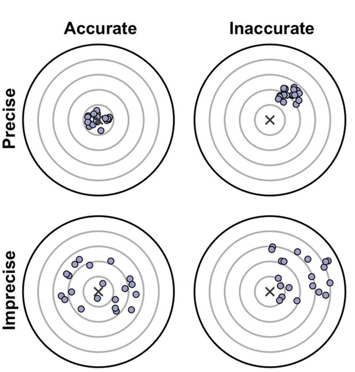

```{r setup, include=FALSE}
options(htmltools.dir.version = FALSE)
knitr::opts_chunk$set(echo=TRUE, message = FALSE, warning = FALSE, comment = "#>", fig.align = "center")
options(dplyr.print_min = 5, dplyr.print_max = 5)
```


class: middle, center, inverse

# Estimação
---

### Parâmetro e Estatística

**Parâmetro**: é uma medida usada para descrever uma característica da população.


**Estatística** ou **Estimador**: é qualquer função de uma amostra aleatória (fórmula ou expressão), construída com o propósito de servir como instrumento para descrever alguma característica da amostra e para fazer *inferência* a respeito da característica na população.  


Resumo | Parâmetro | Estatística
---|:---:|:---:
Média | $\mu$ | $\bar{x}=\frac{1}{n} \sum \limits_{i=1}^n x_i$
Variância | $\sigma^2$| $s^2 = \frac{1}{n-1} \sum \limits_{i=1}^n {(x_i - \mu)^2}$
Proporção | $\pi$ ou $p$ | $\hat{p}= \frac{X}{n}$

O valor numérico da estatística ou estimador de um parâmetro, calculado para uma amostra observada, é chamado de **estimativa desse parâmetro**.

A diferença entre estatística e estimativa é que a **estatística** é uma variável aleatória, e a estimativa é um particular valor dessa variável aleatória.


---

## Acurácia  
A acurácia mede quão próximo o valor estimado está do valor real, ou seja, é a habilidade do estimador de estimar o valor real.


---

## Precisão  
A Precisão mede quão próximas estimativas individuais estão umas das outras, ou seja é a habilidade do estimador de estimar valores similares de maneira consistente.


--

```{r,out.width = "100%",fig.cap="",fig.align = 'center',echo=FALSE}
# knitr::include_graphics("https://raw.githubusercontent.com/arpanosso/estatinfo/master/slides/img/acuracia_precisao.png")
```

---


---
## Propriedades de um bom estimador

**1) Consistência**: é uma propriedade por meio da qual a acurácia de uma estimativa aumenta quando o tamanho da amostra aumenta. Assim dado um parâmetro populacional $\theta$ e sendo $\hat{\theta}$  o estimador desse parâmetro. 

As condições suficientes para um estimador ser consistente são:

$$\lim_{n \to \infty}E(\hat{\theta}) = \theta$$

$$\lim_{n \to \infty}Var(\hat{\theta}) = 0$$

### Exemplos

$$E(\bar{X}) = \mu$$
$$Var(\bar{X})= \frac{Var(X)}{n}$$

---

## Propriedades de um bom estimador

**2) Não viciado ou não viesado**: O estimador  $\hat{\theta}$  como uma variável aleatória, tem uma certa distribuição em repetidas amostras de tamanho $n$. Não viciado é uma propriedade que assegura que, em média, o estimador é correto:

O **estimador** é chamado **não viciado** ou **imparcial** se seu valor esperado ou médio for igual ao verdadeiro valor do parâmetro, ou seja:

$$E(\hat{\theta}) = \theta$$

Entretanto, se

$E(\hat{\theta}) = \theta + b(\theta)$ com $b(\theta) \neq 0$,

o estimador é **viciado** e a quantidade $b(\theta)$ é chamada vício ou viés.

---
### Exemplos de Estimadores

Estes estimadores nada mais são do que as próprias definições dos respectivos parâmetros, mas aplicadas à amostra:

$E(\bar{X})=\mu$ e $E(\hat{p}) = p$


Por sua vez, para a variância o estimador populacional $\sigma^2 = \frac{1}{n} \sum \limits_{i=1}^n (x -\bar{x})^2$ é viciado, pois, podemos demonstrar que:

$E(\hat{\sigma}^2)=\frac{n-1}{n}\sigma^2 = \sigma^2 - \frac{1}{n}\sigma^2$

onde o viés $b(\sigma^2) = -\frac{1}{n} \sigma^2$.

Abaixo segue o estimador não viciado para variância:

$s^2 = \frac{1}{n-1} \sum \limits_{i=1}^n (x -\bar{x})^2$  

No entanto, para $n \to \infty$, têm-se para ambos os estimadores convergem para $\sigma^2$, ou seja, $\hat{\sigma}^2$ e $s^2$ são assintoticamente não viciados.

---
class: middle, inverse, center

# Acesse o Link para estudarmos essas Propriedades

## https://arpanosso.shinyapps.io/estatinfo/


---
class: middle, center, inverse

# Estimativa por Ponto e por Intervalo

---

### Estimativa por ponto

É a estimativa de um parâmetro populacional dada por um único valor para a estatística, exemplo:


$$\hat{X} = \mu$$

esse procedimento não permite julgar qual a possível magnitude do erro que se está cometendo.

**Exemplo**: 

-- a média de ganho salarial dos funcionários da empresa X é de `R$` $5520{,}35$

-O diâmetro a altura do peito de árvores de Eucalipto tem uma média de $105 \;cm$,

---

### Estimativa por intervalo

É a estimativa de um parâmetro populacional baseada na distribuição amostral do estimador pontual, dada por dois valores $a$ e $b$ $(a < b)$, entre os quais se considera que o parâmetro esteja contido.

Essas estimativas indicam a sua precisão ou acurácia, por isto são preferíveis às estimativas por ponto.

A declaração da precisão de uma estimativa por intervalo denomina-se grau de confiança ou **nível de confiança**, daí a denominação de **Intervalo de Confiança**.

**Exemplo**: 


- a média de ganho salarial dos funcionários da empresa X é de `R$` $5520{,}35 \pm 3.800$

- O diâmetro a altura do peito de árvores de Eucalipto tem uma média de $105 \pm 0,05\;cm$;


---

class: middle, center, inverse

# Estimativa por Intervalo de Confiança

---

### Estimativa por Intervalo de Confiança

Um intervalo de confiança para $\theta$ é um intervalo construído a partir das observações da amostra, de modo que ele inclui o verdadeiro e desconhecido valor de $\theta$, **com uma específica e alta probabilidade** denotada por $1 - \alpha$, é tipicamente tomada como:

$$NC = P(a \le \theta \le b) = 1-\alpha$$

Então, o intervalo $] a, b [$ é chamado intervalo com $100 \cdot (1 - \alpha)\%$ de confiança para o parâmetro $\theta$, onde: $1 ‑ \alpha$  é  o **nível de confiança**, $\alpha$ é denominado **nível de significância** associado ao intervalo e os valores $a$ e $b$ são os **limites de confiança**, inferior e superior, respectivamente, do intervalo.

Onde temos a seguinte relação:

Nível de Confiança (NC) | Nível de significância $(\alpha)$
:---:|:---:
$0,90$ | $0,10$
$0,95$ | $0,05$
$0,99$ | $0,01$


---
class: middle, center, inverse

# Intervalo de Confiança para a Média Populacional $(\mu)$

---

## Precisamos definir $4$ casos:

#### (a) Caso em que amostras são grandes $(n \geq 30)$ e $\sigma$ conhecido;

#### (b) Caso em que amostras são grandes $(n \geq 30)$ e $\sigma$ desconhecido;

#### (c) Caso em que as amostras são pequenas $(n < 30)$ $\sigma$ conhecido;

#### (d) Caso em que as amostras são pequenas $(n < 30)$ e $\sigma$ desconhecido.

---

### (a) Caso em que amostras são grandes $(n \geq 30)$ e $\sigma$ conhecido.

O desenvolvimento de intervalos de confiança para $\mu$ é baseado na distribuição amostral de $\bar{X}$ se o tamanho da amostra $(n)$ é grande:

$$Z = \frac{\bar{X}- \mu}{\frac{\sigma}{\sqrt{n}}} \cong N(0,1)$$


```{r,out.width = "30%",fig.cap="",fig.align = 'center',echo=FALSE}
knitr::include_graphics("https://raw.githubusercontent.com/arpanosso/estatinfo/master/slides/img/ic_01.png")
```
onde:  
$a = \bar{X} - z_{\alpha/2} \frac{\sigma}{\sqrt{n}}$ e $b = \bar{x} + z_{\alpha/2} \frac{\sigma}{\sqrt{n}}$

$$
\begin{cases}
\frac{\sigma}{\sqrt{n}} = \sigma_{\bar{X}} = \text{erro padrão da média} \\
z_{\alpha/2} \frac{\sigma}{\sqrt{n}} = \text{erro da estimativa da média} 
\end{cases}
$$

---

### Exemplo

Se $1 - \alpha = 0,95$ nesse caso $\alpha = 0,05$

```{r,out.width = "100%",fig.cap="",fig.align = 'center',echo=FALSE}
knitr::include_graphics("https://raw.githubusercontent.com/arpanosso/estatinfo/master/slides/img/ic_02.png")
```

---

[Tabela - Normal Padrão](https://github.com/arpanosso/estatinfo/raw/master/docs/TabelaNormalPadrao.pdf) 

```{r,out.width = "75%",fig.cap="",fig.align = 'center',echo=FALSE}
knitr::include_graphics("https://raw.githubusercontent.com/arpanosso/estatinfo/master/slides/img/ic_03.png")
```

---

Esta expressão, deve ser interpretada do seguinte modo: construídos todos os intervalos da forma $\bar{X} \pm 1,96 \sigma_{\bar{X}}$, $95\%$ deles conterão $\mu$. Lembrando  que $\mu$ não é uma variável aleatória, mas um parâmetro, isto é, não é o mesmo que dizer que $\mu$ tem $95\%$ de probabilidade de estar entre os limites indicados.

```{r,out.width = "95%",fig.cap="",fig.align = 'center',echo=FALSE}
knitr::include_graphics("https://raw.githubusercontent.com/arpanosso/estatinfo/master/slides/img/ic_04.png")
```

---

Então, denotamos o intervalo de confiança como:

$$IC(\mu;1-\alpha) = ]\bar{x}-z_{\alpha/2} \frac{\sigma}{\sqrt{n}};\bar{x}+z_{\alpha/2} \frac{\sigma}{\sqrt{n}}[$$

### Exemplo 

Uma pesquisa analisou uma amostra de $100$ microempreendedores individuais (MEIs) de um município, verificando que o faturamento médio diário é de `R$` $171{,}70$. Sabendo que o desvio padrão populacional é $\sigma$ = $7{,}79$, construa um IC de $95\%$ para o faturamento médio diário $\mu$ de todos os MEIs do município.
--

$$IC(\mu;95\%) = ]171,70 \pm 1,96 \frac{7,79}{\sqrt{100}} $$
$$IC(\mu;95\%) = ]170,17; 173,23[$$
---

### (b) Caso em que amostras são grandes $(n \geq 30)$ e $\sigma$ desconhecido.

Como $n$ é grande, a substituição de $\sigma$ pelo desvio padrão amostral $(s)$ não afeta apreciavelmente a estimativa de $IC$, assim, temos que:


$$IC(\mu;1-\alpha) = ]\bar{x}-z_{\alpha/2} \frac{s}{\sqrt{n}};\bar{x}+z_{\alpha/2} \frac{s}{\sqrt{n}}[$$

---

### (c) Caso em que as amostras são pequenas $(n < 30)$ e $\sigma$ conhecido.

Se $X_1, X_2, \cdots, X_n$ é uma amostra aleatória de uma população com distribuição normal $N (\mu, \sigma^2)$, a média amostral $\bar{X}$ é exatamente distribuída como $N (\mu, \frac{\sigma^2}{n} )$. Sendo $\sigma$ conhecido, o $IC (\mu : 1–\alpha)$ é dado por:

$$IC(\mu;1-\alpha) = ]\bar{x}-z_{\alpha/2} \frac{\sigma}{\sqrt{n}};\bar{x}+z_{\alpha/2} \frac{\sigma}{\sqrt{n}}[$$

---

### (d) Caso em que as amostras são pequenas $(n < 30)$ e $\sigma$ desconhecido.

Fato que ocorre na maioria dos casos, uma aproximação intuitiva é substituir $\sigma$ por $s$ considerar a razão:

$$t = \frac{\bar{x} - \mu}{\frac{s}{\sqrt{n}}}$$

Essa substituição causa uma considerável diferença se a amostra for pequena. A notação $t$ é requerida porque $s$ aumenta a variância de $t$ para um valor maior do que um $(1)$, de modo que a razão não é padronizada. 


A distribuição da razão $t$ é conhecida como **distribuição $t$ - Student** com parâmetro $r = n – 1$ graus de liberdade.


---

#### Distribuição t de Student

[Tabela - Distribuição t-Student](https://github.com/arpanosso/estatinfo/raw/master/docs/Tabela_tdeStudent.pdf) 

```{r,out.width = "100%",fig.cap="",fig.align = 'center',echo=FALSE}
knitr::include_graphics("https://raw.githubusercontent.com/arpanosso/estatinfo/master/slides/img/ic_05.png")
```

---

### Distribuição t de Student

As distribuições $t$ são simétricas em torno de zero mas têm caudas mais espalhadas do que a distribuição $N(0, 1)$. Entretanto, com o aumento de $r$, a distribuição $t$ se aproxima da distribuição $N(0, 1)$, pois $Var(t)$ tende à unidade $(1)$.

$$\begin{cases} E(t) = 0 \\
Var(t) = \frac{r}{r-2} = \frac{n-1}{n-3}\end{cases}$$

Pode-se concluir da distribuição $t$, que

$$P(-t_{\alpha/2} \le \frac{\bar{x}-\mu}{\frac{s}{\sqrt{n}}} \le +t_{\alpha/2}) = 1 - \alpha$$
em que $t_{\alpha \\2}$ é obtido na tabela da distribuição $t$ com $r = n – 1$ graus de liberdade, ou seja:

$$IC(\mu;1-\alpha) = ]\bar{x}-t_{\alpha/2} \frac{s}{\sqrt{n}};\bar{x}+t_{\alpha/2} \frac{s}{\sqrt{n}}[$$
---

Comparação Distribição Normal Padrão e Distribuição t de Student

$N(0,1)$ - Azul  
$t(1)$ - Vermelho  

```{r, echo=FALSE}
curve(dnorm(x),-3,3, col="blue",
      xlab="x",las=1,
      ylab="density")
curve(dt(x,1),-3,3, col="red",add=TRUE)
```

---
Comparação Distribição Normal Padrão e Distribuição t de Student

$N(0,1)$ - Azul  
$t(5)$ - Vermelho  

```{r, echo=FALSE}
curve(dnorm(x),-3,3, col="blue",
      xlab="x",las=1,
      ylab="density")
curve(dt(x,5),-3,3, col="red",add=TRUE)
```
---

Comparação Distribição Normal Padrão e Distribuição t de Student

$N(0,1)$ - Azul  
$t(20)$ - Vermelho  

```{r, echo=FALSE}
curve(dnorm(x),-3,3, col="blue",
      xlab="x",las=1,
      ylab="density")
curve(dt(x,20),-3,3, col="red",add=TRUE)
```

---

Comparação Distribição Normal Padrão e Distribuição t de Student


$N(0,1)$ - Azul  
$t(30)$ - Vermelho  

```{r, echo=FALSE}
curve(dnorm(x),-3,3, col="blue",
      xlab="x",las=1,
      ylab="density")
curve(dt(x,30),-3,3, col="red",add=TRUE)
```


---
Comparação Distribição Normal Padrão e Distribuição t de Student


$N(0,1)$ - Azul  
$t(50)$ - Vermelho  

```{r, echo=FALSE}
curve(dnorm(x),-3,3, col="blue",
      xlab="x",las=1,
      ylab="density")
curve(dt(x,50),-3,3, col="red",add=TRUE)
```


---
### Exercício

Uma amostra de $10$ talhões de cana-de-açúcar submetidos a um estresse hídrico severo apresentou uma produtividade média de $46{,}9$ toneladas por hectare e desvio padrão de $43{,}3$ t/ha. Determine os limites de confiança de $90\%$ para $\mu$.

--

**Solução**

média amostral $\bar{x} = 46{,}9$   
desvio padrão amostral $s = 43{,}3$   
nível de confiança $1-\alpha = 0{,}90$   
graus de liberdade $r = n-1=9$  

Olhando a tabela da distribuição t-Student temos: $t_{\alpha/2} = 1{,}833$ 

Portanto, os limites de confiança de $\mu$ serão:

$\bar{x} \pm t_{\alpha/2} \frac{s}{\sqrt{n}} = 46{,}9\pm 1{,}833  \frac{43{,}3}{\sqrt{10}}$

Assim: $IC(\mu:90\%) = ]21{,8}; 72[$ t/ha

---

class: middle, center, inverse

# Intervalo de Confiança para a Proporção

---

Fazendo uso do fato que, para $n$ grande, a distribuição binomial pode ser aproximada com a normal:

$$Z = \frac{x - n.p}{\sqrt{n.p.q}} = \frac{\hat{p}-p}{\sqrt{\frac{\hat{p} \hat{q}}{n}}} \tilde{ }N(0,1)$$

Temos:

$$P \left(-z_{\frac{\alpha} {2}} \le \frac{x- np}{\sqrt{np(1-p)}} \le +z_{\alpha/2} \right) = 1 - \alpha$$

Substituindo $p$, visto que é desconhecido, por seu estimador $\hat{p}$  dentro das raízes, obtêm-se:

$$IC(\hat{p};1-\alpha) = \left]\hat{p}-z_{\alpha/2} \sqrt{\frac{\hat{p}\hat{q}}{n}};\hat{p}+z_{\alpha/2} \sqrt{\frac{\hat{p}\hat{q}}{n}} \right[$$

---

### Exemplo

Em um ensaio de controle biológico, $n = 400$ alagartas-do-cartucho (*Spodoptera frugiperda*), oram expostas ao agente *Bacillus thuringiensis*, observando-se mortalidade em $X = 320$ insetos, correspondendo a $80\%$ de eficácia.  Determine o $IC$ para $p$, com $1 - \alpha = 0,90$.


```{r,out.width = "85%",fig.cap="",fig.align = 'center',echo=FALSE}
knitr::include_graphics("https://raw.githubusercontent.com/arpanosso/estatinfo/master/slides/img/ic_07.png")
```

---

### Exemplo  
Em um ensaio de controle biológico, $n = 400$ alagartas-do-cartucho (*Spodoptera frugiperda*), oram expostas ao agente *Bacillus thuringiensis*, observando-se mortalidade em $X = 320$ insetos, correspondendo a $80\%$ de eficácia.  Determine o $IC$ para $p$, com $1 - \alpha = 0,90$.

```{r,out.width = "80%",fig.cap="",fig.align = 'center',echo=FALSE}
# knitr:include_graphics("https://raw.githubusercontent.com/arpanosso/estatinfo/master/slides/img/ic_08.png")
```

**Solução**

estimativa da proporção $\hat{p} = 400/320 = 0{,}80$   
estimativa do complementar $\hat{q} = 1- \hat{p} = 1-0{,}80=0{,}20$   
nível de confiança $1-\alpha = 0{,}90$   

Olhando a tabela da distribuição Normal Padrão temos:  
$z_{\alpha/2} = 1{,}64$ 

Portanto, os limites de confiança de $p$ serão:

$\hat{p} \pm z_{\alpha/2} \sqrt{\frac{\hat{p}\hat{q}}{n}} = 1{,}64 \sqrt{\frac{0{,}80 \times0{,}20}{400}}$

Assim: $IC(p:90\%) = ]0{,}767; 0{,}833[$ t/ha

